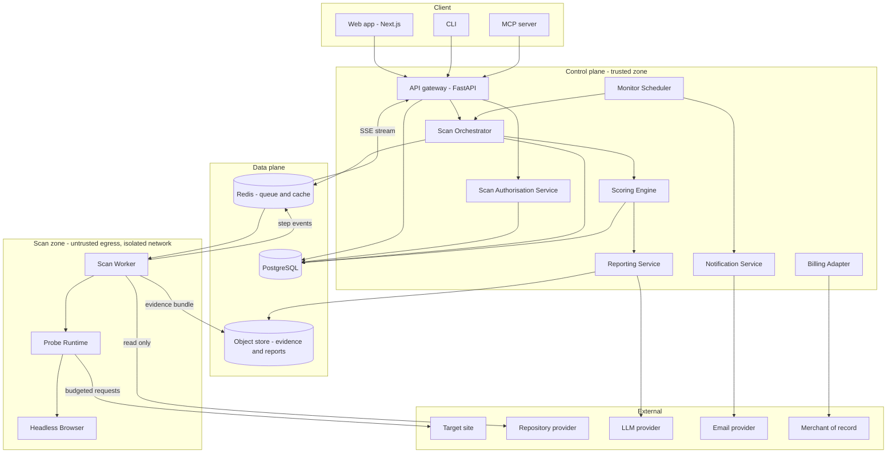
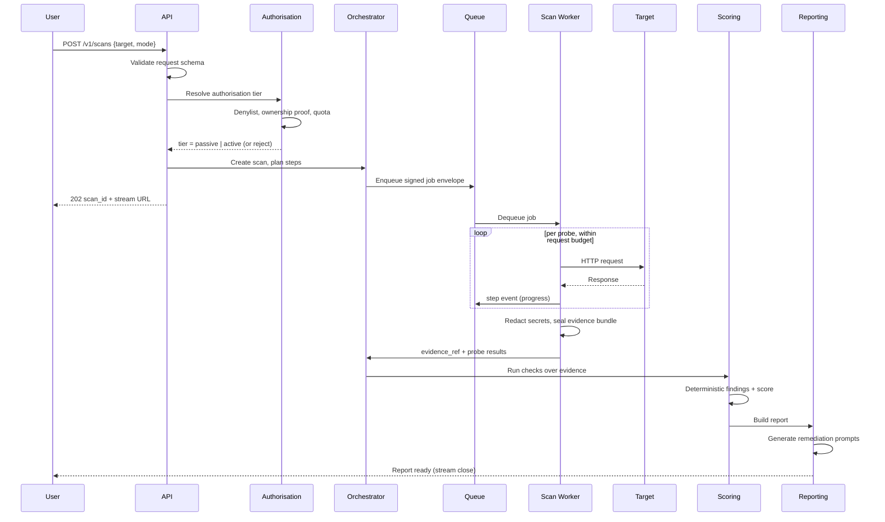
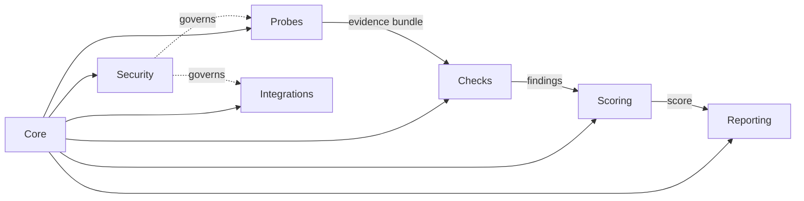
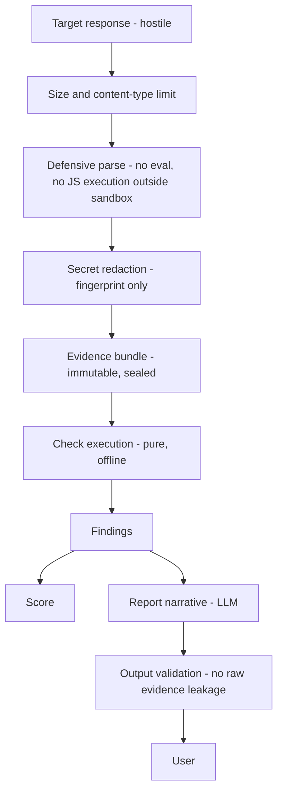

# System Architecture

## Purpose

This document describes the layers, components, network zones, technology choices and
runtime behaviour of Vigilo. It extends ADR 0001 (core layered model) with the concrete
shape of this product. It is authoritative for the Architecture Agent and Refactor Agent.

---

## 1. Architectural drivers

The design is dominated by four forces:

1. **Untrusted egress.** The system deliberately sends traffic to arbitrary third-party
   hosts. That traffic must be isolated, budgeted, attributable and revocable.
2. **Untrusted ingress.** Everything a target returns — headers, HTML, JavaScript, JSON —
   is hostile input that must be parsed defensively and never evaluated.
3. **Determinism.** Scores are compared over time. The same target in the same state must
   produce the same score, or monitoring is meaningless.
4. **Low-latency perception.** The user watches the scan run. Work must be streamed, not
   batched, even though the total work is unchanged.

Driver 1 and 2 together produce the central structural decision: **the component that
touches the internet does nothing else.**

---

## 2. Layer model

Mapped onto ADR 0001.

| ADR 0001 layer | Vigilo realisation |
| --- | --- |
| Core | `packages/core` — models, schema validation, sanitised logging, error taxonomy, config |
| Modules | `packages/probes`, `packages/checks`, `packages/scoring`, `packages/reporting`, integrations |
| Pipeline | Scan orchestrator, job queue, scheduler, CI/CD workflows |
| Security | Authorisation service, egress policy, rate governor, redaction, audit trail |
| Documentation | `/docs`, ADRs, check manifests as generated documentation |

---

## 3. Component diagram

### Zone rules

- The **scan zone** holds no database credentials, no user data and no billing context. It
  receives a signed job envelope and returns an evidence bundle.
- The **control plane** never makes an outbound request to a target. Ever.
- Communication between zones is queue-only. There is no synchronous call path from the
  control plane into the scan zone or back.
- The scan zone egresses from a fixed, published IP pool so target owners can allowlist or
  block Vigilo deliberately.

---

## 4. Request lifecycle

The user receives a scan identifier immediately and a stream of step events while probes
run. Nothing about the response depends on the scan completing.

---

## 5. Technology choices

| Concern | Choice | Reason |
| --- | --- | --- |
| Frontend | Next.js + TypeScript + Tailwind | Streaming UI, static marketing pages, one deploy target |
| API | Python 3.12 + FastAPI + Pydantic v2 | Pydantic gives schema-first validation as a language feature, matching the repository validation model; keeps the existing pytest standard |
| Queue | Redis + ARQ | Async-native, minimal operational surface; Celery only if fan-out exceeds one machine |
| Database | PostgreSQL + SQLAlchemy + Alembic | Relational findings, time-series scores, JSONB evidence metadata |
| Object storage | S3-compatible (R2 / MinIO) | Evidence bundles and PDFs; lifecycle-expired |
| Headless browser | Playwright (Chromium) | Bundle inspection needs a real renderer; also drives PDF export |
| Scan workers | Isolated container hosts, fixed egress IPs | Zone separation is a network property, not a code property |
| LLM | Claude API | Report narrative and remediation prompts; never used to decide findings |
| Auth | Managed provider (Clerk or Supabase Auth) | Identity is not a differentiator; do not build it |
| Billing | Merchant of record (Paddle / Lemon Squeezy) | Outsources EU VAT, invoicing, withdrawal rights |
| Email | Transactional provider (Resend / Postmark) | Alerts and reports |
| Ops scripts | PowerShell + Pester | Preserves existing repository convention for automation |

Rationale and rejected alternatives: ADR 0002.

---

## 6. Module boundaries

Every module obeys the repository rule set: single responsibility, validated inputs,
no cross-module state, sanitised logging only.

Hard constraints:

- **Probes may not import checks.** A probe does not know what a finding is.
- **Checks may not perform I/O.** A check is a pure function. This is enforced in CI by a
  static import rule; a check module importing `httpx`, `socket` or `os` fails the build.
- **Scoring may not read evidence.** It consumes findings only, so the score model can be
  revised without re-running probes.
- **Reporting may not create findings.** The LLM writes prose about findings that already
  exist; it cannot add, remove or reclassify one.

Full module contracts: `modules.md`.

---

## 7. Data flow and trust boundaries

Detail: `data-flow.md`.

Trust boundaries crossed, in order: internet to scan zone, scan zone to object store,
object store to control plane, control plane to LLM provider, control plane to user.
Each crossing has an explicit validation step. No boundary is crossed with raw evidence
attached.

---

## 8. Determinism model

Determinism is an architectural property, not a testing aspiration.

- Evidence bundles are content-addressed and immutable.
- Check execution is pure; no clock, no randomness, no network.
- Each scan records `catalog_version` and `score_model_version`.
- A score is only ever compared to another score computed with the same
  `score_model_version`. Version changes create a visible break in score history rather
  than a silent shift.
- Replay is a first-class operation: `vigilo replay <evidence_ref> --catalog <version>`
  reproduces any historical report exactly, and is the regression harness in CI.

---

## 9. Scaling model

| Component | Scaling axis | Notes |
| --- | --- | --- |
| API | Horizontal, stateless | Behind a load balancer; SSE via Redis pub/sub |
| Scan workers | Horizontal by queue depth | Bounded concurrency per target host, not per worker |
| Headless browser | Separate pool | Slowest and heaviest; scale independently of HTTP probes |
| PostgreSQL | Vertical first | Partition `findings` and `scan_steps` by month when needed |
| Object store | Managed | Lifecycle: evidence 90 days, reports per retention policy |

The binding constraint is not CPU. It is politeness: total requests per second per target
host must stay low enough that a scan is never mistaken for an attack. Concurrency is
therefore capped at the target level and enforced by a distributed rate governor, not left
to worker parallelism.

---

## 10. Failure model

| Failure | Behaviour |
| --- | --- |
| Target unreachable | Scan completes with `unreachable` status; no score is emitted |
| Target partially unreachable | Affected checks are `inconclusive`, never `passed` |
| Probe timeout | Step marked timed out; score computed from available evidence with reduced confidence flag |
| Worker crash | Job returns to queue; scan is idempotent by `scan_id` |
| LLM provider down | Report renders with template remediation text; narrative degrades gracefully |
| Score model bug | Replay harness detects divergence in CI before deploy |

A check that cannot be evaluated is never silently marked as passing. `inconclusive` is a
distinct, user-visible state.

---

## 11. Testing strategy

- **Unit (pytest).** Every check gets fixture evidence bundles: at least one positive, one
  negative, one malformed. Checks are pure, so this is cheap and fast.
- **Golden corpus.** A labelled set of frozen evidence bundles from real generator output.
  CI replays the full catalogue against it and fails on any change in verdicts not
  accompanied by a catalogue version bump.
- **Integration.** Probes run against a local target-simulator fixture serving controlled
  headers, bundles and paths. No live third-party targets in CI, ever.
- **Contract.** OpenAPI schema snapshot; breaking changes fail the build.
- **Ops (Pester).** Deployment and egress-policy scripts.

Coverage floors follow the repository standard: 80% general, 90% for `core`, `checks`,
`scoring` and the security modules.

---

## 12. Compliance with repository standards

| Standard | Compliance |
| --- | --- |
| Layered architecture | Section 2, aligned to ADR 0001 |
| Clear module boundaries | Section 6, enforced by CI import rules |
| Zero trust | Sections 7 and 10; every boundary validates |
| No sensitive data in logs | Redaction before evidence sealing; secrets stored as fingerprints |
| Deterministic behaviour | Section 8 |
| ADR governance | ADR 0002 (stack), ADR 0003 (authorisation) |

---

## Final note

Two decisions carry this architecture and should not be revisited casually: the isolation
of the scan zone, and the purity of the check layer. Everything else — framework, queue,
hosting — is replaceable.
