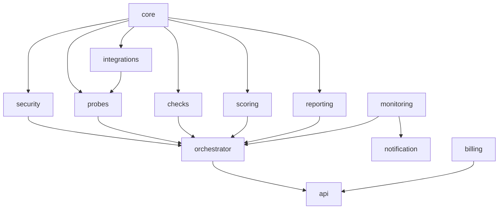
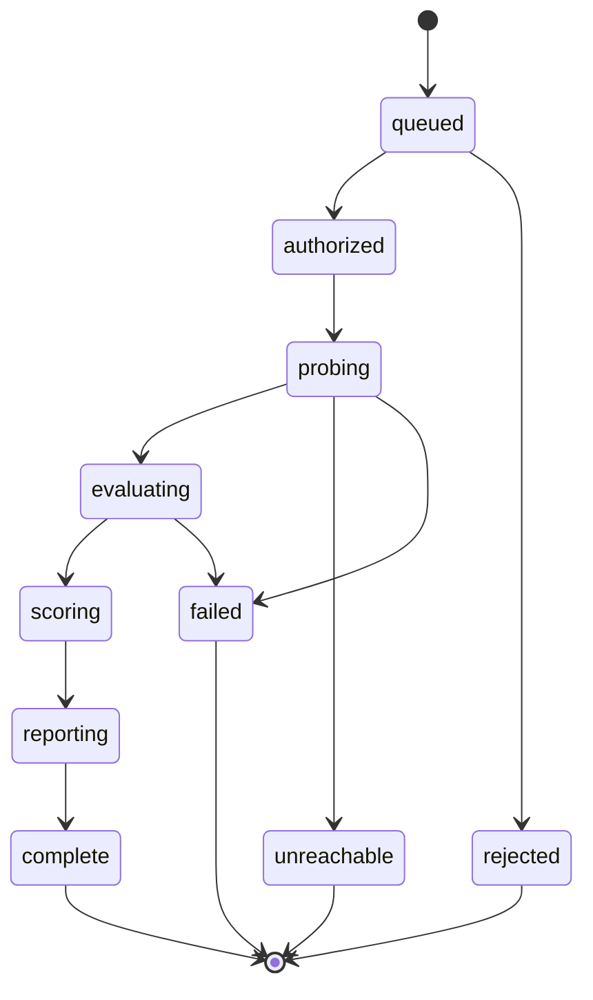

# Modules

## Purpose

This document is the authoritative catalogue of every module in Vigilo: responsibility,
boundary, public API, dependencies and security posture. It is the reference for the
Architecture Agent, Refactor Agent and Scan Engine Agent. No module may exist without an
entry here.

Boundary rule for all modules: single responsibility, validate every input at the edge,
communicate only through the declared API, no shared mutable state, log only sanitised
data through Core.

---

## Dependency graph



Cycles are prohibited and enforced by an import-graph check in CI.

---

## 1. core

**Responsibility.** Foundational primitives shared by every other module.

- Domain models (`Target`, `Scan`, `Evidence`, `Finding`, `Score`, `CheckManifest`)
- Schema-first validation primitives
- Structured, sanitised logging
- Error taxonomy and structured error objects
- Configuration and brand token loading
- Redaction utilities (secret fingerprinting)

**Boundaries.** No business logic. No network. No database access. No knowledge of any
specific check, probe or provider.

**API**

```python
validate(model, payload) -> Model            # raises ValidationError
log(event: LogEvent) -> None
error(code: ErrorCode, message: str, **ctx) -> StructuredError
redact(value: str) -> Fingerprint            # sha256 prefix + shape, never the value
config() -> Config
```

**Dependencies.** None. Root module.

**Security.** All logging passes through here, so redaction cannot be bypassed by a caller.
`redact` is the only sanctioned way any secret-shaped string enters persistent storage.

---

## 2. security

**Responsibility.** Everything that decides whether an action against a third party is
permitted, and records that it happened.

- Scan authorisation: tier resolution, ownership proof verification
- Target denylist and SSRF guard (private ranges, IP literals, protected sectors)
- Rate governor: per-account, per-target-host, global
- Abuse heuristics: enumeration patterns, target churn, verification-bypass attempts
- Audit trail writer (append-only)

**Boundaries.** Cannot execute a probe. Cannot modify a finding. It is an authoriser and a
recorder, never an actor.

**API**

```python
resolve_authorization(account, target, requested_mode) -> AuthorizationDecision
verify_ownership(target, method) -> VerificationResult
check_rate(account, target_host) -> RateDecision
audit(event: AuditEvent) -> None
```

**Dependencies.** core.

**Security.** Fail-closed. Any error in tier resolution downgrades to `passive` or rejects;
it never upgrades. Every decision is written to the audit trail before the scan is queued.

Detail: `security.md`, ADR 0003.

---

## 3. probes

**Responsibility.** Collect evidence about a target. This is the only module permitted to
make outbound requests to a target.

Probe families:

| Probe | Collects |
| --- | --- |
| `dns` | A/AAAA/CNAME/TXT/MX records, nameservers, CAA |
| `tls` | Certificate chain, expiry, protocol versions, HTTPS enforcement |
| `http` | Response status, headers, cookies, redirect chain for a bounded path set |
| `render` | DOM after load, network waterfall, third-party origins contacted |
| `bundle` | Fetched JS/CSS assets, source-map presence, inlined configuration |
| `wellknown` | `robots.txt`, `sitemap.xml`, `security.txt`, `manifest.json` |
| `paths` | Existence of a fixed, published list of commonly exposed artefacts (Tier 1 only) |
| `subdomain` | Candidate hostnames from certificate transparency and passive DNS (Tier 1) |
| `repo` | Read-only file tree and content of a connected repository (opt-in) |

**Boundaries.** A probe records what happened. It never interprets, never assigns severity,
never imports `checks`. It cannot decide its own budget — the budget arrives in the job
envelope.

**API**

```python
run(probe_id, target, budget: RequestBudget) -> ProbeResult
seal(results: list[ProbeResult]) -> EvidenceBundle   # content-addressed, immutable
```

**Dependencies.** core, security (for the governor), integrations (for `repo`).

**Security.** Every response is size-capped and content-type-checked before parsing.
JavaScript is executed only inside the sandboxed browser context, never in the worker
process. Redaction runs before the bundle is sealed, so no unredacted secret is ever
written to storage.

---

## 4. checks

**Responsibility.** Convert evidence into findings.

A check is a pure function plus a manifest. The manifest declares identity, category,
severity, required evidence, and the remediation template. The function returns a verdict.

**Boundaries.** No I/O of any kind. No clock. No randomness. No mutation of the evidence
bundle. A check that cannot find the evidence it declared returns `inconclusive`, never
`passed`.

**API**

```python
@dataclass(frozen=True)
class CheckManifest:
    id: str                    # e.g. "VG-SEC-0101"
    category: CheckCategory
    severity: Severity
    intrusiveness: Level       # L0 passive | L1 light active
    requires: list[EvidenceKind]
    remediation: RemediationTemplate

def evaluate(evidence: EvidenceBundle) -> Verdict   # passed | failed | inconclusive | not_applicable
```

**Dependencies.** core only. This is deliberate and enforced: the import allowlist for
`packages/checks` contains `core` and the standard library.

**Security.** Findings never carry a secret value, only a fingerprint and a location.

Detail: `scan-engine.md`, catalogue: `check-catalog.md`.

---

## 5. scoring

**Responsibility.** Turn a finding set into a versioned, deterministic score and grade.

**Boundaries.** Consumes findings only. Never reads evidence. Never re-evaluates a check.
The score model is versioned; a change is a new version, never an edit.

**API**

```python
score(findings: list[Finding], model_version: str) -> ScoreResult   # 0-100, grade, breakdown
compare(previous: ScoreResult, current: ScoreResult) -> Delta
```

**Dependencies.** core.

**Security.** No user-supplied weighting. The model is fixed per version so scores cannot
be gamed by request parameters.

---

## 6. reporting

**Responsibility.** Render findings for humans: HTML report, PDF, badge, remediation prompt
text.

**Boundaries.** Cannot create, delete or reclassify a finding. The LLM writes narrative
around a finding set that is already fixed. Report generation is idempotent.

**API**

```python
build_report(scan_id) -> Report
render_pdf(report) -> bytes
render_badge(public_id) -> SVG
generate_remediation(finding, stack_profile) -> Prompt
```

**Dependencies.** core, scoring, integrations (LLM provider).

**Security.** Output validation before release: no raw evidence, no unredacted secret, no
internal identifier. If the LLM provider fails, the module falls back to the static
remediation template in the check manifest.

---

## 7. integrations

**Responsibility.** All communication with named third-party providers.

| Adapter | Purpose |
| --- | --- |
| `repo` | Read-only repository access (installation-scoped token) |
| `llm` | Report narrative and remediation prompt generation |
| `mail` | Transactional email |
| `billing` | Subscription state via merchant of record webhooks |
| `storage` | Object store reads and writes |

**Boundaries.** One adapter per provider. Business logic never talks to a provider SDK
directly. Every response is validated against a schema before it leaves the adapter.

**API**

```python
call(adapter_id, request: AdapterRequest) -> AdapterResponse
```

**Dependencies.** core.

**Security.** Provider credentials injected at runtime, never in the repository. Repository
tokens are installation-scoped and read-only. Responses are treated as untrusted input and
sanitised on the way in.

---

## 8. orchestrator

**Responsibility.** Own the lifecycle of a scan: plan, enqueue, track, assemble, finalise.

State machine:



**Boundaries.** No probing. No check evaluation. No scoring arithmetic. It coordinates the
modules that do those things and owns the persisted scan record.

**API**

```python
create_scan(account, target, mode) -> Scan
advance(scan_id, event: ScanEvent) -> Scan
stream(scan_id) -> Iterator[ScanStepEvent]
```

**Dependencies.** core, security, probes, checks, scoring, reporting.

**Security.** Signs the job envelope handed to the scan zone. The envelope carries the
resolved tier and the request budget; a worker cannot widen its own scope.

---

## 9. monitoring

**Responsibility.** Scheduled re-scans and regression detection.

**Boundaries.** Does not scan. It schedules and compares.

**API**

```python
create_monitor(project, cadence) -> Monitor
due_monitors(now) -> list[Monitor]
detect_regression(previous: Scan, current: Scan) -> RegressionReport
```

**Dependencies.** core, orchestrator, scoring.

**Security.** A monitor inherits the authorisation tier of its target and re-validates it
on every run. Ownership revocation immediately downgrades all future scheduled scans.

---

## 10. notification

**Responsibility.** Deliver alerts. Email in v1, webhook in v2.

**Boundaries.** No decision logic. It renders and delivers what monitoring produced.

**API**

```python
notify(account, event: NotificationEvent) -> DeliveryResult
```

**Dependencies.** core, integrations.

**Security.** Alert bodies contain finding titles and severities, never evidence, never a
secret fingerprint's location detail. Deep links require an authenticated session.

---

## 11. billing

**Responsibility.** Map merchant-of-record subscription state to entitlements, and enforce
quota.

**Boundaries.** Never handles card data. Never talks to a card network. Entitlement
evaluation only.

**API**

```python
entitlements(account) -> Entitlements
consume(account, meter: Meter, amount: int) -> QuotaDecision
apply_webhook(event: MoREvent) -> None
```

**Dependencies.** core, integrations.

**Security.** Webhooks are signature-verified and replay-protected. Quota is enforced
server-side at authorisation time, never in the client.

---

## 12. api

**Responsibility.** The HTTP surface: web app backend, public API, MCP backend, SSE stream.

**Boundaries.** No domain logic. Every handler validates, delegates to one module, and
serialises the result.

**Dependencies.** All of the above.

**Security.** Authentication on every route. Request schema validation before dispatch.
Response schema validation before release. Per-key rate limits. Full detail: `api.md`.

---

## Final note

Any change to a module's responsibility, API or dependency list requires an update to this
document in the same change set. A pull request that alters a module boundary without
touching this file fails review.
