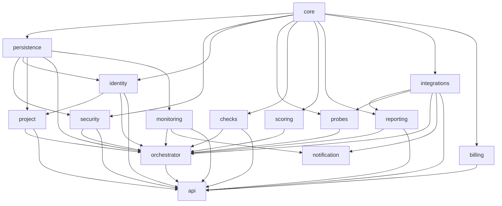
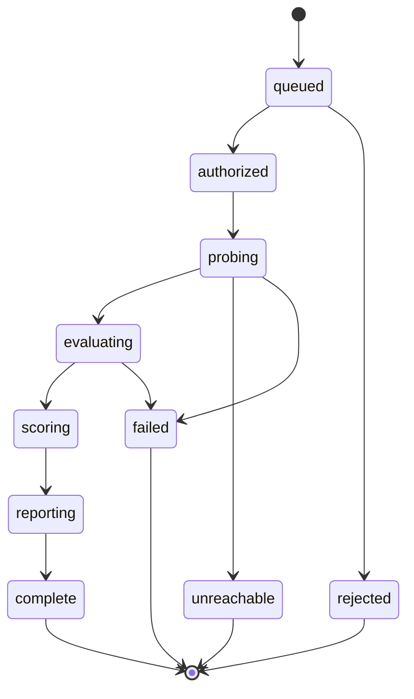

# Modules

## Purpose

This document is the authoritative catalogue of every module in Vigilo: responsibility,
boundary, public API, dependencies and security posture. It is the reference for the
Architecture Agent, Refactor Agent and Scan Engine Agent. No module may exist without an
entry here.

Boundary rule for all modules: single responsibility, validate every input at the edge,
communicate only through the declared API, no shared mutable state, log only sanitised
data through Core.

---

## Dependency graph



Cycles are prohibited and enforced by an import-graph check in CI.
(`persistence`, `identity` and `project` were added in Phase 3 — see their
sections below, inserted as `1a`/`2a`/`2b` rather than renumbering the rest
of this document, since many source files already cite `docs/modules.md §N`
by number.)

`CORE --> BILLING` and `INTEG --> API` were missing from this diagram before
Phase 7 closed the gap: the former was always true (`billing` has always
been specced as depending on `core`) and simply hadn't been drawn; the
latter is a genuinely new edge Phase 7 introduces — `apps/api`'s billing
router is the first place `apps/api` imports `vigilo_integrations` directly,
for the checkout/webhook adapter (§11's deviation note explains why this
replaced the originally-sketched `billing --> integrations` edge instead).

`PERSIST --> MONITOR`, `MONITOR --> API` and `INTEG --> NOTIFY` are Phase 8
additions: `monitoring` owns real persistence (`MonitorRow`/`AlertRow`, §9)
unlike `billing`, so it needs `persistence` directly; `apps/api`'s new
monitors/badge routers (§9) are the first place `apps/api` imports
`vigilo_monitoring`; `notification` calls `send_transactional_email()`
(§10), so it needs `integrations` directly, exactly as originally sketched
— no deviation there, unlike `billing`.

---

## 1. core

**Responsibility.** Foundational primitives shared by every other module.

- Domain models (`Target`, `Scan`, `Evidence`, `Finding`, `Score`, `CheckManifest`)
- Schema-first validation primitives
- Structured, sanitised logging
- Error taxonomy and structured error objects
- Configuration and brand token loading
- Redaction utilities (secret fingerprinting)

**Boundaries.** No business logic. No network. No database access. No knowledge of any
specific check, probe or provider.

**API**

```python
validate(model, payload) -> Model            # raises ValidationError
log(event: LogEvent) -> None
error(code: ErrorCode, message: str, **ctx) -> StructuredError
redact(value: str) -> Fingerprint            # sha256 prefix + shape, never the value
config() -> Config
```

**Dependencies.** None. Root module.

**Security.** All logging passes through here, so redaction cannot be bypassed by a caller.
`redact` is the only sanctioned way any secret-shaped string enters persistent storage.

---

## 1a. persistence

**Responsibility.** The shared SQLAlchemy primitives every persistence-backed
module builds on: one declarative `Base`, the async engine/session factory,
and the Alembic migration environment.

**Boundaries.** No domain models, no business logic, no knowledge of any
specific table. Added in Phase 3 as infrastructure alongside Core, not
inside it — ADR-0001 rule 1 ("Core has no database access") stays true
because Core itself gains no new dependency; this is a separate package
that depends on Core.

**API**

```python
Base                      # declarative base every orm.py registers models against
get_engine() -> AsyncEngine
session_scope() -> AsyncContextManager[AsyncSession]   # commit-on-success, rollback-on-exception
```

**Dependencies.** core.

**Security.** None directly — it holds no domain data. Its Alembic
migrations are where the audit trail's append-only guarantee is actually
enforced (a database trigger, not application code) — see `security.md` §5.

---

## 2. security

**Responsibility.** Everything that decides whether an action against a third party is
permitted, and records that it happened.

- Scan authorisation: tier resolution, ownership proof verification
- Target denylist and SSRF guard (private ranges, IP literals, protected sectors)
- Rate governor: per-account, per-target-host, global
- Abuse heuristics: enumeration patterns, target churn, verification-bypass attempts
- Audit trail writer (append-only)

**Boundaries.** Cannot execute a probe. Cannot modify a finding. It is an authoriser and a
recorder, never an actor.

**API** (Phase 3 — `resolve_authorization`/`verify_ownership`/`audit` are real;
`check_rate` remains a Phase 6/7 placeholder, per the roadmap's scope trim —
Phase 3's `resolve_authorization()` folds a minimal, DB-derived scan-count
ceiling directly into its own inputs instead)

```python
resolve_authorization(request: AuthorizationRequest) -> AuthorizationDecision
# pure function over primitives/enums only — no ORM types, so security's
# dependency footprint below stays core + persistence, not core + project.
# The caller (an apps/api handler) loads Account/Target/OwnershipProof state
# and reduces it to AuthorizationRequest's fields first.

verify_ownership(method: VerificationMethod, origin: str, expected_nonce: str,
                  resolver=None, transport=None, txt_resolver=None) -> VerificationResult
# dns_txt | wellknown_file | meta_tag | email (email raises NotImplementedError
# in Phase 3 — needs a click-through flow that has no home before Phase 4).
# wellknown_file/meta_tag call validate_and_pin() first, same as any probe.

audit(session, event: AuditEvent) -> None
# takes an already-open session so "authorize -> audit -> create ScanJob"
# commits as one transaction, per ADR-0003's ordering requirement.
```

**Dependencies.** core, persistence. (The persistence dependency is new in
Phase 3 — a deliberate, documented expansion from core-only, since the
audit trail writer needs real DB access. Called out per the roadmap's
standing rule #2 since it's part of the authorization model.)

**Security.** Fail-closed. Any error in tier resolution downgrades to `passive` or rejects;
it never upgrades. Every decision is written to the audit trail before the scan is queued.
`verify_ownership`'s network-touching methods run inside `apps/scanner`'s ARQ worker, never
called synchronously from `apps/api` — see the ADR-0003 Phase 3 addendum.

Detail: `security.md`, ADR 0003.

---

## 2a. identity

**Responsibility.** Accounts, sessions, tenancy.

**Boundaries.** Owns `Account` persistence only. Does not verify sessions
itself for every request (`apps/api` does that via `vigilo_security`-free
JWT verification against Clerk's JWKS) — it owns the *mapping* from a
verified external identity to a local account.

**API**

```python
get_or_create_account(session, email, clerk_user_id=None) -> Account
get_account_by_id(session, account_id) -> Account | None
get_account_by_clerk_id(session, clerk_user_id) -> Account | None
get_account_by_email(session, email) -> Account | None
get_subscription_by_account(session, account_id) -> Subscription | None
upsert_subscription(session, account_id, plan_id, status, provider,
                     provider_subscription_id, current_period_end) -> Subscription
```

**Persistence (Phase 7).** `SubscriptionRow` (`docs/data-model.md`'s
`subscriptions` table) lives here, next to `AccountRow`, rather than in a
`billing`-owned ORM — see §11's deviation note. `upsert_subscription()` is
keyed on `provider_subscription_id` (a replayed webhook event updates the
existing row rather than duplicating it) and cascades `AccountRow.plan_id`
in the same flush: to `plan_id` when `status == "active"`, to `"free"`
otherwise — a canceled subscription must not leave the account holding its
paid entitlements forever, since `vigilo_billing.entitlements()` only ever
reads `Account.plan_id`, never `Subscription.status` directly. Same
same-transaction-cascade pattern `mark_proof_verified()` already established
for `Target.verification_status` (`packages/project`).

**Dependencies.** core, persistence.

**Security.** No password/credential storage — auth is delegated entirely
to Clerk. `get_or_create_account`'s email-based linking (see
`docs/data-model.md`) is the only place two identities (anonymous email,
authenticated Clerk user) merge into one account.

---

## 2b. project

**Responsibility.** Projects, targets, ownership proofs.

**Boundaries.** Cannot perform network I/O to a target — issuing and
recording ownership proofs is pure persistence; the actual DNS/HTTP checks
live in `vigilo_security.verify_ownership`, called from `apps/scanner`.

**API**

```python
get_or_create_default_project(session, account_id) -> Project
create_target(session, project_id, origin) -> Target
get_target(session, target_id) -> Target | None
get_target_by_origin(session, project_id, origin) -> Target | None
set_opt_out(session, target_id, flag) -> None
issue_ownership_proof(session, target_id, method) -> OwnershipProof
get_ownership_proof(session, proof_id) -> OwnershipProof | None
has_valid_ownership_proof(session, target_id) -> bool
mark_proof_verified(session, proof_id) -> OwnershipProof
```

**Dependencies.** core, persistence, identity (for the `accounts.id` FK
type reference only — no runtime call into `identity`'s functions).

**Security.** `mark_proof_verified` is the only path that upgrades a
target's `verification_status`, and it's only ever called after
`vigilo_security.verify_ownership` returns `verified=True`.

---

## 3. probes

**Responsibility.** Collect evidence about a target. This is the only module permitted to
make outbound requests to a target.

Probe families:

| Probe | Collects |
| --- | --- |
| `dns` | A/AAAA/CNAME/TXT/MX records, nameservers, CAA |
| `tls` | Certificate chain, expiry, protocol versions, HTTPS enforcement |
| `http` | Response status, headers, cookies, redirect chain for a bounded path set |
| `render` | DOM after load, network waterfall, third-party origins contacted |
| `bundle` | Fetched JS/CSS assets, source-map presence, inlined configuration |
| `wellknown` | `robots.txt`, `sitemap.xml`, `security.txt`, `manifest.json` |
| `paths` | Existence of a fixed, published list of commonly exposed artefacts (Tier 1 only) — **implemented, Phase 6** |
| `subdomain` | Candidate hostnames from certificate transparency and passive DNS (Tier 1) |
| `repo` | Read-only file tree and content of a connected repository (opt-in) |

**Boundaries.** A probe records what happened. It never interprets, never assigns severity,
never imports `checks`. It cannot decide its own budget — the budget arrives in the job
envelope.

**Deviation (Phase 1+, Phase 6 addition).** `run_probes(url, tier=Tier.PASSIVE,
resolver=None, transport=None) -> EvidenceBundle`
(`packages/probes/src/vigilo_probes/orchestrator.py`) is the actual entry
point — one concrete orchestration function assembling every sub-probe
into a sealed `EvidenceBundle`, not a per-probe `run(probe_id, target,
budget)` dispatcher as this section's sketch below still shows (this
predates Phase 6, unchanged here). **Phase 6 adds** the `tier` parameter —
the probe-layer half of active-tier gating: `run_paths()` (`paths_probe.py`)
only runs when `tier == Tier.ACTIVE`, so an unverified target never
receives the `paths` probe's hidden-path-enumeration requests at all — not
merely has the resulting findings filtered out afterward. See
`docs/adr/ADR-0003-scan-authorization-model.md`'s Phase 6 addendum.

**API**

```python
run(probe_id, target, budget: RequestBudget) -> ProbeResult
seal(results: list[ProbeResult]) -> EvidenceBundle   # content-addressed, immutable
```

**Dependencies.** core, security (for the governor), integrations (for `repo`).

**Security.** Every response is size-capped and content-type-checked before parsing.
JavaScript is executed only inside the sandboxed browser context, never in the worker
process. Redaction runs before the bundle is sealed, so no unredacted secret is ever
written to storage.

---

## 4. checks

**Responsibility.** Convert evidence into findings.

A check is a pure function plus a manifest. The manifest declares identity, category,
severity, required evidence, and the remediation template. The function returns a verdict.

**Boundaries.** No I/O of any kind. No clock. No randomness. No mutation of the evidence
bundle. A check that cannot find the evidence it declared returns `inconclusive`, never
`passed`.

**Deviation (Phase 1+).** The actual `CheckManifest`
(`packages/core/src/vigilo_core/models.py`) uses `tier_required: Tier`
(`passive`/`active`), not `intrusiveness: Level`, and has no `requires:
list[EvidenceKind]` field — evidence-dependency is instead expressed
procedurally via the `@requires("field_name")` decorator
(`packages/checks/src/vigilo_checks/registry.py`), checked at runtime
against `EvidenceBundle`'s matching attribute. This predates Phase 6,
unchanged here. **Phase 6 adds** `budget_cost: int = Field(default=0,
ge=0)` — the marginal request cost a check's own evidence needs beyond its
probe's baseline traffic. Defaults to 0 for every check that predates this
field: checks are pure functions over an already-fetched `EvidenceBundle`
(ADR-0001 rule 2), so their true marginal cost is zero — only non-zero for
the 7 new `paths`-dependent `EXP` checks, whose combined `budget_cost`
reconstructs `paths_probe.py`'s fixed candidate-path count. This is a
descriptor-completeness field, not a runtime-enforced budget — see
`docs/adr/ADR-0003-scan-authorization-model.md`'s Phase 6 addendum for why
the full dynamic "drop lowest-weight checks over budget" planner
(§8.5 of the Prooflight doc) is explicitly deferred, not silently dropped.

**API**

```python
@dataclass(frozen=True)
class CheckManifest:
    id: str                    # e.g. "VG-SEC-0101"
    category: CheckCategory
    severity: Severity
    intrusiveness: Level       # L0 passive | L1 light active
    requires: list[EvidenceKind]
    remediation: RemediationTemplate

def evaluate(evidence: EvidenceBundle) -> Verdict   # passed | failed | inconclusive | not_applicable

# Phase 6 (packages/checks/src/vigilo_checks/findings.py):
def plan_registry(registry: list[Check], tier: Tier) -> list[Check]
    # The check-layer half of active-tier gating — the checks a scan is
    # allowed to evaluate, given its granted tier. Necessary in addition to
    # the probe-layer gate above: run_registry()/to_findings() produce one
    # Finding per check regardless of verdict, so an unreachable check must
    # never be in the list passed to run_registry() at all.
```

**Dependencies.** core only. This is deliberate and enforced: the import allowlist for
`packages/checks` contains `core` and the standard library.

**Security.** Findings never carry a secret value, only a fingerprint and a location.

Detail: `scan-engine.md`, catalogue: `check-catalog.md`.

---

## 5. scoring

**Responsibility.** Turn a finding set into a versioned, deterministic score and grade.

**Boundaries.** Consumes findings only. Never reads evidence. Never re-evaluates a check.
The score model is versioned; a change is a new version, never an edit.

**API**

```python
score(findings: list[Finding], model_version: str) -> ScoreResult   # 0-100, grade, breakdown
compare(previous: ScoreResult, current: ScoreResult) -> Delta
```

**Dependencies.** core.

**Security.** No user-supplied weighting. The model is fixed per version so scores cannot
be gamed by request parameters.

---

## 6. reporting

**Responsibility.** Render findings for humans: HTML report document, PDF, badge,
remediation prompt text.

**Boundaries.** Cannot create, delete or reclassify a finding. The LLM writes narrative
around a finding set that is already fixed. Report generation is idempotent.

**Deviation (Phase 4).** Every function here is pure — no self-fetching by
`scan_id`, unlike the sketch below implies. Callers (`apps/api`'s
`report_rendering.py`) fetch findings/manifests themselves and pass them in,
matching the pattern already set by `resolve_authorization()` and the
`checks` registry. `build_report`'s `generated_at` is a required parameter,
not `datetime.now()`, so the same scan renders identically for the web view
and later for the PDF. `render_pdf` doesn't template HTML itself — it drives
Playwright against the *live* `apps/web` report page
(`{WEB_APP_URL}/reports/{scan_id}?print=1`), so there is exactly one layout
source of truth. `render_badge` ships this phase only as a pure function —
no API route or caching yet; that lands in Phase 8 alongside
`brand.config.json`'s already-reserved `badgePath`.

**Deviation (Phase 5).** `generate_remediation` did not simply swap its body
for a Claude call in place, as the Phase 4 note above once predicted —
it split in two, per `docs/adr/ADR-0004-llm-boundary.md`:
`template_remediation()` stays pure/synchronous and is the *only* remediation
path `build_report()` is allowed to call directly, so a report render never
awaits an LLM or depends on its availability; the new async
`generate_remediation()` (redaction-gated prompt, strict-JSON-validate-or-
discard, template fallback on any failure) is called only from
`packages/orchestrator`'s `generate_remediations_job`, never from a render
path. `build_report()` gained an optional `remediations_by_check_id` param
— a dict of already-generated results the caller fetched from the
`remediation_cache` table (`docs/data-model.md`); the call site *did*
change, correcting the Phase 4 note's prediction that it wouldn't.

**API**

```python
build_report(target_origin, score, findings, manifests_by_check_id, generated_at, remediations_by_check_id=None) -> ReportDocument
render_pdf(scan_job_id, pdf_renderer=None) -> bytes
render_badge(score, generated_at) -> str   # SVG
template_remediation(finding, manifest) -> RemediationPrompt
generate_remediation(finding, manifest, stack_profile=None, llm_caller=None) -> RemediationPrompt
```

**Dependencies.** core, integrations (Phase 5 — `generate_remediation`'s
default `llm_caller` lazily imports `vigilo_integrations.generate_remediation_text`,
matching `render_pdf`'s lazy Playwright import). `render_pdf` also reads
`WEB_APP_URL` from `core`'s config.

**Security.** Output validation before release: no raw evidence, no unredacted secret, no
internal identifier. If the LLM provider fails, the module falls back to the static
remediation template in the check manifest. `generate_remediation`'s prompt
construction is allowlist-based, not a general redaction filter — see
`docs/adr/ADR-0004-llm-boundary.md` for exactly which fields it reads and
the named residual prompt-injection risk from untrusted finding content.

---

## 7. integrations

**Responsibility.** All communication with named third-party providers.

| Adapter | Purpose |
| --- | --- |
| `repo` | Read-only repository access (installation-scoped token) |
| `llm` | Claude text generation, via Anthropic's Messages API (Phase 5) |
| `mail` | Transactional email |
| `billing` | Subscription state via merchant of record webhooks |
| `storage` | Object store reads and writes |

**Boundaries.** One adapter per provider. Business logic never talks to a provider SDK
directly. Every response is validated against a schema before it leaves the adapter.

**Deviation (Phase 5).** `llm.py` matches `mail.py`'s existing "no SDK — a
single POST is all the provider needs" precedent: a raw `httpx` call to
Anthropic's Messages API rather than the `anthropic` SDK, keeping this
package's dependency footprint unchanged. It validates only its own
response shape (a 2xx with text content); the Vigilo-domain JSON schema
inside that text is `packages/reporting`'s concern, one layer up.

**API**

```python
call(adapter_id, request: AdapterRequest) -> AdapterResponse
generate_remediation_text(prompt, system=None, transport=None) -> str
```

**Dependencies.** core.

**Security.** Provider credentials injected at runtime, never in the repository. Repository
tokens are installation-scoped and read-only. Responses are treated as untrusted input and
sanitised on the way in.

---

## 8. orchestrator

**Responsibility.** Own the lifecycle of a scan: plan, enqueue, track, assemble, finalise.

State machine:



**Boundaries.** No probing. No check evaluation. No scoring arithmetic. It coordinates the
modules that do those things and owns the persisted scan record.

**API** (Phase 3 implements the persistence-facing half —
`create_scan_job`/`advance`/`record_scan_result`/`get_scan_by_job_id` in
`service.py` — plus the ARQ task bodies in `jobs.py` (four as of Phase 6:
`run_scan_job`, `verify_ownership_job`, `render_report_pdf_job`,
`generate_remediations_job`) that tie probes+checks+scoring+integrations
together and run inside `apps/scanner`.
`create_scan(account, target, mode)`/`stream(scan_id)` as a single
higher-level entry point, and the job-envelope signing below, are not yet
built — Phase 3's `apps/api` calls `create_scan_job` directly rather than
through a not-yet-existing `create_scan` wrapper.)

```python
create_scan_job(session, target_id, tier, requested_by, registry_version, budget=None) -> ScanJob
advance(session, scan_job_id, new_status) -> ScanJob   # enforces the state machine above
record_scan_result(session, job, findings, result, duration_ms, bundle_id=None) -> Scan
get_scan_by_job_id(session, job_id) -> Scan | None
get_scan(session, scan_id) -> Scan | None

# Phase 4 — Report/ShareLink repository (packages/orchestrator/src/vigilo_orchestrator/reports.py):
get_findings_for_scan(session, scan_id) -> list[Finding]
get_or_create_html_report(session, scan_id) -> Report
get_or_create_pdf_report(session, scan_id) -> tuple[Report, bool]   # bool: should_render
mark_report_complete(session, report_id) -> Report
mark_report_failed(session, report_id) -> Report
get_report_pdf_bytes(session, report_id) -> bytes
create_share_link(session, report_id, expires_in_days=None) -> tuple[ShareLink, str]   # str: plaintext token, returned once
resolve_share_link(session, token) -> ShareLink | None
revoke_share_link(session, share_link_id) -> ShareLink

# Phase 5 — remediation cache repository (packages/orchestrator/src/vigilo_orchestrator/remediation.py):
get_remediations_for_findings(session, findings, registry_version) -> dict[str, RemediationPrompt]   # bulk, keyed by check_id
cache_remediation(session, fingerprint, check_id, registry_version, prompt) -> None   # no-op unless prompt.source == "llm"

# Phase 8 — score-history/diffing queries (packages/orchestrator/src/vigilo_orchestrator/service.py):
list_scans_for_target(session, target_id, limit=50) -> list[Scan]   # score history, no new table
list_ever_failed_fingerprints_before(session, target_id, before) -> frozenset[str]   # feeds vigilo_monitoring.diff
get_failed_findings_for_scan(session, scan_id) -> dict[str, Finding]   # fingerprint-keyed, Verdict.FAILED only

# ARQ task bodies (packages/orchestrator/src/vigilo_orchestrator/jobs.py),
# registered by apps/scanner's WorkerSettings, never called from apps/api:
run_scan_job(ctx, scan_job_id: str) -> None
    # Phase 6: reads job.tier and threads it into both run_probes(tier=...)
    # and plan_registry(REGISTRY, tier) — the two-layer active-tier gate.
    # Phase 8: always enqueues "detect_regression_job" after scoring, and
    # "record_scan_failed_alert_job" from each of its three failure
    # branches — both by ARQ's string-based enqueue_job, never by Python
    # import (their bodies live in apps/scanner, not here — see §9).
verify_ownership_job(ctx, proof_id: str) -> None
render_report_pdf_job(ctx, report_id: str) -> None
generate_remediations_job(ctx, scan_job_id: str) -> None   # Phase 5, auto-enqueued from run_scan_job
```

**Dependencies.** core, persistence, security, probes, checks, scoring,
integrations, identity, project, reporting (Phase 4 — `render_report_pdf_job`
calls `vigilo_reporting.render_pdf`/`vigilo_integrations.put_report_pdf`;
Phase 5 — `generate_remediations_job` calls
`vigilo_reporting.generate_remediation`).

**Security.** Signs the job envelope handed to the scan zone. The envelope carries the
resolved tier and the request budget; a worker cannot widen its own scope. (The
envelope actually handed to the worker is just the `scan_job_id`/`proof_id`
string ARQ passes — the worker re-reads the authorized tier from the
`ScanJobRow` itself rather than trusting a signed payload. This is no
longer a purely aspirational note as of Phase 6: `run_scan_job` now
actually reads and acts on `job.tier` — see the two-layer gate above and
`docs/adr/ADR-0003-scan-authorization-model.md`'s Phase 6 addendum. Real
envelope-signing, and the full dynamic request-budget planner, both remain
deferred — no specific phase claims them yet; not to be confused with
`CheckManifest.budget_cost`, a Phase 6 descriptor field with no runtime
enforcement engine behind it, per `docs/modules.md` §4.)

---

## 9. monitoring

**Status: implemented, Phase 8.**

**Responsibility.** Scheduled re-scans and regression detection.

**Boundaries.** Does not scan. It schedules and compares. Persists its own
`Monitor`/`Alert` rows (unlike `billing`, which deliberately stays
ORM-free, §11) — a monitor's schedule and an alert's history are this
module's own state, not something another module already owns.

**API** (`packages/monitoring/src/vigilo_monitoring/`)

```python
create_monitor(session, target_id, account_id, cadence_hours, next_run_at,
               quiet_start_utc=None, quiet_end_utc=None) -> Monitor   # idempotent by target_id
due_monitors(session, now) -> list[Monitor]
detect_regression(previous_failed: dict[str, Finding], current_failed: dict[str, Finding],
                   ever_failed_before_previous: frozenset[str], previous_registry_version: str,
                   current_registry_version: str, previous_score: float, current_score: float,
                   had_pending_score_drop: bool) -> RegressionReport
compute_next_run_at(cadence_hours, quiet_start_utc, quiet_end_utc, now, jitter_minutes=15) -> datetime
```

**Deviation.** `create_monitor`/`due_monitors`/persistence functions take a
session (this module owns real tables), but `detect_regression()` and
`compute_next_run_at()` are pure — no session, no `Scan`/`Monitor` objects,
just primitives and `vigilo_core.models.Finding` — matching the
`resolve_authorization`/`consume` precedent. The sketched
`detect_regression(previous: Scan, current: Scan)` signature would only
distinguish "present in scan N-1" from "absent," which cannot tell a
genuinely new finding from one that regressed after being resolved; the
real signature adds `ever_failed_before_previous` (a fingerprint set
spanning every scan strictly before N-1) to make that distinction, fed by
two new `packages/orchestrator` queries (`list_scans_for_target`,
`list_ever_failed_fingerprints_before`, §8) rather than a persistent
per-`Finding` lifecycle-status column.

**Alert types.** `new_critical`/`new_high` (a fingerprint failing for the
first time ever, severity ≥ high), `regressed` (failing again after having
been resolved), `cert_expiry` (a special case of `VG-TLS-004`'s
failed-transition, reusing existing persisted `FindingRow` data rather than
a new TLS-evidence read at diff time), `score_drop` (≥10 points, gated by
hysteresis — confirmed only on a second consecutive drop, or immediately
alongside a `new_critical`/`cert_expiry` event), `scan_failed` (the
scheduled job itself failed, not diff-derived — enqueued from
`run_scan_job`'s three failure branches, `packages/orchestrator/jobs.py`).
A `resolved` transition is computed internally but never becomes an
`Alert` — no alert type exists for it in the domain model.

**Where the job bodies live.** `check_due_monitors_job` (an ARQ cron job,
every 15 minutes), `detect_regression_job` and `record_scan_failed_alert_job`
are NOT in `packages/orchestrator/jobs.py` alongside the other job bodies —
they live in `apps/scanner/src/vigilo_scanner/jobs.py` instead, since this
module depends on `orchestrator` and putting the job bodies there too would
make `orchestrator` depend back on `monitoring`, a cycle. `run_scan_job`
enqueues `"detect_regression_job"`/`"record_scan_failed_alert_job"` by ARQ's
string-based `enqueue_job`, never by Python import, so the graph stays
one-directional — an app is always free to depend on both.

**Security.** A scheduled run always requests active tier and lets
`resolve_authorization()` downgrade it — the exact function
`submit_scan()` uses, re-run on every cycle, so ownership revocation
immediately downgrades the next scheduled scan. A denylisted/opted-out
target's monitor is disabled rather than repeatedly failing.

---

## 10. notification

**Status: implemented, Phase 8.**

**Responsibility.** Deliver alerts. Email only this phase — webhooks
remain a later addition, not built.

**Boundaries.** No decision logic. It renders and delivers what monitoring
produced — specifically, whether several occurrences collapse into one
digest email (the vision doc's "more than five events... collapse into a
single summary email" rule) is `monitoring`'s decision, made by how many
`AlertOccurrence`s it puts in one `NotificationEvent`; `notify()` only
picks a single-alert or digest rendering based on that count, a mechanical
choice, not a business one.

**API** (`packages/notification/src/vigilo_notification/`)

```python
notify(event: NotificationEvent, transport=None) -> DeliveryResult
```

Never raises — a delivery failure (`MailDeliveryFailed`) comes back as
`DeliveryResult(delivered=False, reason=...)`, mirroring how
`run_scan_job` already handles its own report-email failures.

**Dependencies.** core, integrations. Calls
`vigilo_integrations.mail.send_transactional_email()` directly — no new
integration-layer function was needed, since it was already generic
(`to`/`subject`/`html_body`).

**Security.** Alert bodies contain finding titles/check ids and
severities, never evidence, never a secret fingerprint's location detail.
Every email links to `{WEB_APP_URL}/targets/{id}/monitoring`, which
requires an authenticated session — never a direct link into a finding's
evidence panel.

---

## 11. billing

**Status: implemented, Phase 7.**

**Responsibility.** Map merchant-of-record subscription state to entitlements, and enforce
quota.

**Boundaries.** Never handles card data. Never talks to a card network. Entitlement
evaluation only.

**API** (`packages/billing/src/vigilo_billing/`)

```python
entitlements(plan_id: str | None) -> Entitlements       # unknown/None -> free
consume(current_usage: int, amount: int, meter: Meter, entitlements: Entitlements) -> QuotaDecision
interpret_webhook_event(payload: dict[str, Any]) -> MoREvent   # raises UnrecognizedWebhookEvent
```

**Dependencies.** `core` only.

**Meters (Phase 8 addition).** `Meter` gained `MONITORS` alongside the
existing `TARGETS`/`SCANS_MONTHLY`, and `Plan` gained `monitors_limit`
(Free `0`, Builder `3`, Studio `25` — mirroring each plan's `targets_limit`,
since one monitor per target is the natural ceiling). Scheduled/monitored
scans do **not** consume `SCANS_MONTHLY` — `monitors_limit` is the only
cost bound on monitoring, checked once at monitor-creation time
(`docs/build-roadmap.md`'s Phase 8 entry has the full reasoning).

**Deviation (Phase 7).** The API above differs from the sketch this section
originally carried in two ways, both matching the precedent Phase 3 set for
`resolve_authorization` (`packages/security`) and Phase 4 for `build_report`
(`packages/reporting`): a pure function over primitives, not a self-fetching
one. `entitlements()`/`consume()` take `account`/`account.plan_id` and a
live usage count as plain arguments rather than an `Account` object —
`billing` never imports `identity` or opens a session, so the caller
(`apps/api`) composes whatever persisted state it needs (a `plan_id`, a
`COUNT(*)` from `vigilo_project`/`vigilo_orchestrator`) and passes plain
values in. Second, the sketched `apply_webhook(event) -> None` — which
implied `billing` performing its own persistence — is split: `billing`
only *interprets* the raw payload into a typed `MoREvent`
(`interpret_webhook_event()`); `apps/api`'s webhook route applies it via
`vigilo_identity.upsert_subscription()` (§2a). This is also why the
dependency list dropped `integrations`: signature verification and payload
parsing (`verify_webhook_signature()`, `parse_webhook_event()`,
`create_checkout_url()`) live in `packages/integrations/billing.py` and are
called directly by `apps/api`'s billing router, never by `billing` itself —
`billing` only ever sees the already-parsed `dict`. `consume()` never
raises; the caller decides whether to construct and raise the (also new)
`QuotaExceeded` error.

`packages/billing/tests/test_import_boundary.py` makes the `core`-only
boundary build-blocking, the same AST-only-scan pattern
`packages/checks/tests/test_import_boundary.py` already established.

**Persistence.** `Subscription` — the one piece of billing-adjacent state
that *is* persisted — lives in `packages/identity` next to `Account`, not in
a `billing`-owned ORM (§2a, `docs/data-model.md`'s `subscriptions` table).

**Provider.** Paddle is the concrete reference implementation of "a
merchant of record" (ADR-0002 lists it first); stubbed against
locally-computed signatures, never a real account — see
`packages/integrations/src/vigilo_integrations/billing.py`.

**Security.** Webhooks are signature-verified (`Paddle-Signature` header,
HMAC-SHA256) before the body is ever parsed; an invalid signature is
rejected with `401` before Paddle's retry logic would kick in. Quota is
enforced server-side at authorisation time (`apps/api`'s `targets`/`scans`
routers), never in the client. See `docs/security.md`'s webhook note for the
attack-surface framing.

---

## 12. api

**Responsibility.** The HTTP surface: web app backend, public API, MCP backend, SSE stream.

**Boundaries.** No domain logic. Every handler validates, delegates to one module, and
serialises the result. Must never import `probes` (or `orchestrator.jobs`, or the
`scanner` app) — the control plane never makes an outbound request to a target
(`docs/architecture.md` §3), enforced by `apps/api/tests/test_no_egress_imports.py`.

**Dependencies.** All of the above except `probes` directly (reached only
transitively through `orchestrator.service`, never imported by this app's own code).
Phase 4 adds direct dependencies on `checks` (the pure, I/O-free `REGISTRY` —
`report_rendering.py` builds a `CheckManifest` lookup for remediation text/
references/category, doesn't weaken the egress-import guard below) and
`reporting` (`build_report`/`render_badge`). Phase 8 adds `monitoring`
(the new monitors/scores/alerts/badge routers, §9).

**Security.** Authentication on every route that isn't explicitly public
(`POST /v1/scans`, `GET /v1/scans/{id}`, `GET /v1/scans/{id}/report`, the PDF
routes, `GET /v1/share/{token}`, `GET /badge/{target_id}.svg`,
`POST /v1/billing/webhook` — see `api.md`). Request schema
validation before dispatch. Response schema validation before release.
Per-key rate limits (Phase 9's public API; Phase 3's session-authenticated
surface uses a minimal scan-count ceiling instead, see `security.md` §3).
Full detail: `api.md`.

---

## Final note

Any change to a module's responsibility, API or dependency list requires an update to this
document in the same change set. A pull request that alters a module boundary without
touching this file fails review.
