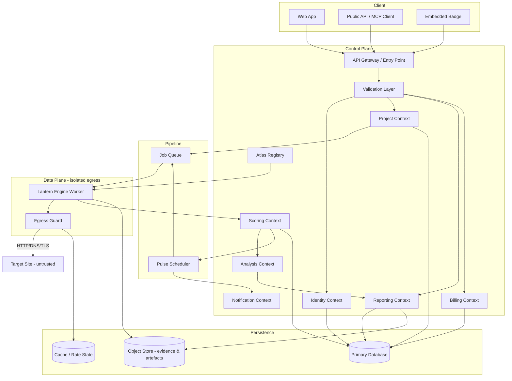
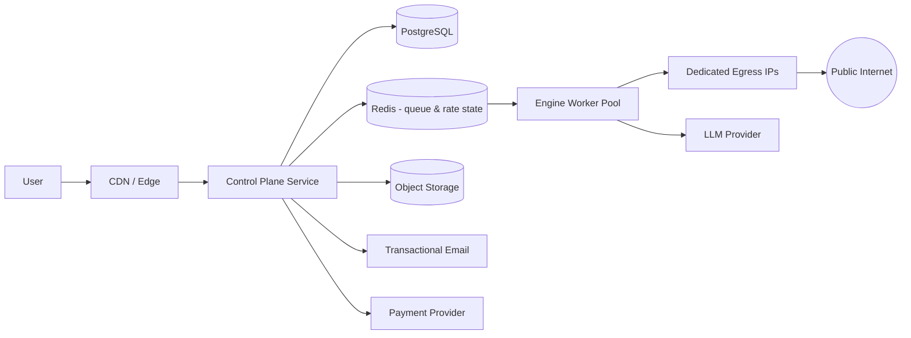
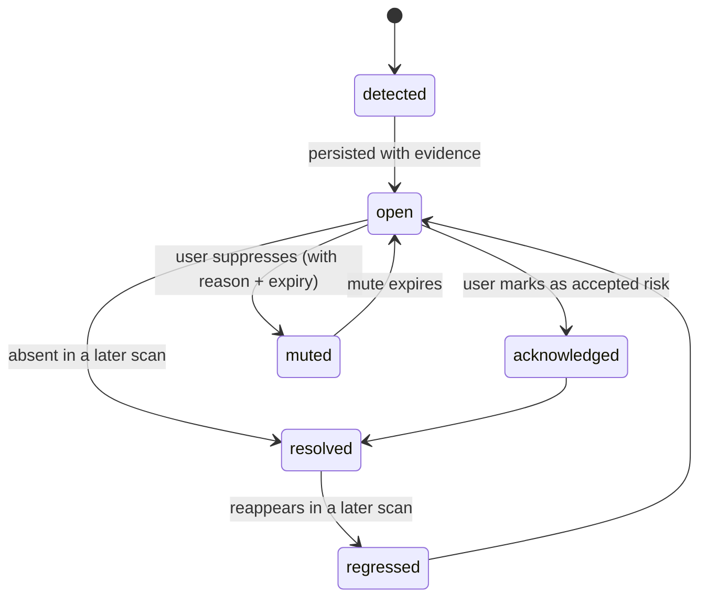
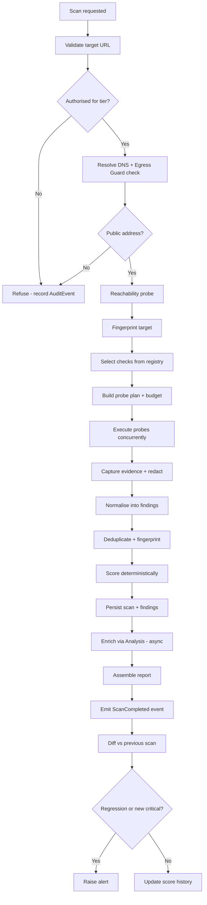
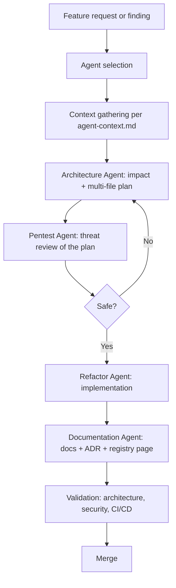

# Prooflight — Product Vision & Architecture

| Field | Value |
|---|---|
| Document ID | `docs/prooflight-vision-and-architecture.md` |
| Status | Draft — proposal for review |
| Date | 2026-09-06 |
| Owning agents | Architecture Agent (primary), Documentation Agent, Pentest Agent |
| Governed by | `.github/copilot-instructions.md`, `architecture.prompt.md`, `documentation.prompt.md` |
| Extends | `ADR-0001-core-architecture.md` |
| Related | `docs/architecture.md`, `docs/modules.md`, `docs/data-flow.md`, `docs/validation.md`, `docs/logging.md`, `docs/security.md`, `docs/ci-cd.md`, `docs/pentest-flow.md`, `docs/agent-safety.md` |

> **Naming placeholder.** `Prooflight` is used throughout as the working brand. It is a single find-and-replace away from any other name. Alternatives that survive a basic trademark sanity check: `Shipproof`, `Launchward`, `Beaconaudit`, `Klarcheck`. Engine codename used below: `lantern` (scan engine), `atlas` (check registry), `pulse` (monitoring).

---

## 0. How to read this document

This document follows the output format mandated by `architecture.prompt.md`:

1. **Analysis** — what exists now (§1)
2. **Plan** — vision, scope, architecture, workflows (§2–§14)
3. **Implementation** — module boundaries, domain model, build order (§5–§6, §21–§22)
4. **Documentation updates** — required doc and ADR changes (§23, §25)
5. **Validation** — architecture, security and CI/CD acceptance criteria (§26)

No source code is included by design. Every diagram is Mermaid, per §2.3 of `copilot-instructions.md`. Every structure is described as a table or a rule so that a single developer can implement it in any stack without re-deriving the design.

---

## 1. Analysis

### 1.1 Category analysis (reference product)

The reference product (`vibelegit.io`) occupies a narrow, well-defined niche: **black-box security and compliance auditing of already-deployed web applications that were generated by AI coding tools.** Functionally, the category consists of eight capabilities:

| # | Capability | Essence |
|---|---|---|
| C1 | Active live scanning | Real HTTP requests against the deployed origin, not static source analysis |
| C2 | Check catalogue | A large, curated registry of security, configuration, infrastructure, compliance and legal checks |
| C3 | Findings & evidence | Each result carries severity, explanation, and the request/response proof that produced it |
| C4 | Remediation guidance | Per-finding fix instructions, formatted for paste-back into an AI coding tool |
| C5 | Scoring | One 0–100 score plus grade, comparable over time |
| C6 | Continuous monitoring | Scheduled re-scans, regression detection, alerting |
| C7 | Reporting & proof | Exportable report, embeddable badge, shareable link |
| C8 | Commercial layer | Projects, quotas, subscription tiers, API access |

The differentiating claim of the category is **stack-specific tuning**: checks written around the failure modes that AI scaffolding tools reproduce (permissive database row-level policies, client-bundled environment secrets, absent legal documents), rather than a generic enterprise checklist.

**What we are not copying.** Marketing copy, visual design, check descriptions, pricing text and any published research are theirs. What is reproducible is the *category shape* — which is public knowledge and largely derived from open standards (OWASP ASVS/Top 10, MDN header guidance, RFC 6797/9110, GDPR Arts. 5/7/12–22, WCAG 2.2). Build the check registry from those primary sources.

### 1.2 Repository baseline

The repository currently contains **governance without a product**: a layered architecture model, module boundaries, validation and logging contracts, CI/CD rules, a pentest workflow, and a four-agent Copilot framework. There is no runtime application, no domain model, no persistence, no interface.

### 1.3 Gap analysis

| Area | Documented today | Missing for Prooflight |
|---|---|---|
| Architecture layers | Core / Modules / Pipeline / Security / Docs | Concrete bounded contexts, deployment topology |
| Modules | Core, Processing, Analysis, Security, Pipeline, Logging, Validation, Integration | Scanner, Registry, Scoring, Monitoring, Reporting, Billing, Identity |
| Data flow | Generic input → output pipeline | Scan lifecycle, evidence handling, target egress path |
| Security | Zero-trust for internal inputs | **Outbound** safety: SSRF, DNS rebinding, target-side rate limiting, authorisation-to-scan |
| Validation | Schema/type/range/pattern | Target URL grammar, ownership proof, check descriptor schema |
| Logging | Structured, sanitised | Scan telemetry, evidence redaction, tenant scoping |
| CI/CD | Pester + pytest, deterministic builds | Check-registry regression suite, golden-target fixtures |
| Legal | Not covered | Authorisation-to-scan model, EU data residency, retention |

**Conclusion:** the governance layer is reusable as-is. This document adds the product layer beneath it and does not modify ADR-0001.

---

## 2. Vision

### 2.1 Problem

People now ship production web applications without ever having read the code that serves them. The generated scaffolding is usually functional and frequently insecure in the same handful of ways. The people affected are not security engineers, cannot interpret a raw scanner report, and discover the problem after it is exploited.

Existing tooling fails them in three directions: enterprise scanners are priced and configured for security teams; free header checkers test one thin surface; source-code linters never see the deployed reality where secrets actually leak.

### 2.2 Product statement

> **Prooflight tells a non-expert builder, in under five minutes and in plain language, what is currently exposed on their live site — with the evidence that proves it, the exact change that fixes it, and a watch that tells them when it breaks again.**

### 2.3 Personas

| Persona | Need | Success signal |
|---|---|---|
| Solo builder | "Is it safe to launch tomorrow?" | Clears all critical findings pre-launch |
| Indie hacker with several projects | "Did my last deploy reopen anything?" | Receives a regression alert, re-scans, score recovers |
| Freelancer / small agency | "Prove to my client this is done properly." | Exports a branded report per client project |
| EU-based operator | "Am I GDPR-exposed?" | Closes consent, policy and retention gaps |

### 2.4 Differentiators to build deliberately

These are the axes on which Prooflight should be *designed* to differ, not merely be cheaper:

1. **Authorisation-first.** Ownership of a target is proven before any active probing beyond a passive baseline. This is a legal moat and a trust signal, not a friction cost.
2. **Evidence-linked findings.** Every finding stores the sanitised request/response pair that triggered it. No unproven assertions; a finding without evidence is a `warning`, never a `critical`.
3. **Deterministic scoring.** Same target state + same registry version ⇒ same score. Scores are only compared across identical registry versions. This makes score history meaningful rather than decorative.
4. **Diff-native monitoring.** The unit of value after the first scan is the *delta*, not the report. Alerts describe what changed and which deploy window it landed in.
5. **EU data residency by default.** Hosting, storage and subprocessors inside the EU, with a published retention schedule. Directly relevant to the GDPR-anxious segment and hard for US-hosted competitors to match retroactively.
6. **Self-hostable engine.** The scan engine ships as a container that a team can run inside its own perimeter, reporting into the hosted control plane. Opens the agency and regulated-customer segment.

### 2.5 Non-goals

- Not an exploitation tool. No payload delivery, no data extraction, no denial of service, no credential stuffing.
- Not a WAF, RASP or runtime agent.
- Not a compliance certification. Output is an automated assessment, stated as such in every artefact.
- Not a general-purpose DAST for authenticated enterprise applications (v1).
- Not a code-hosting or deployment platform.

### 2.6 Naming conventions

Per `copilot-instructions.md` §3.2: folders and files `kebab-case`, classes `PascalCase`, functions `camelCase`, Python `snake_case`, PowerShell `Verb-Noun`. Product-level identifiers:

| Concept | Identifier |
|---|---|
| Scan engine service | `lantern-engine` |
| Check registry | `atlas-registry` |
| Monitoring scheduler | `pulse-scheduler` |
| Check ID format | `PF-<CATEGORY>-<NNN>` e.g. `PF-HDR-014` |
| Finding severity | `critical` \| `high` \| `medium` \| `low` \| `info` \| `passed` |

---

## 3. Scope

### 3.1 MVP — v0.1 "one honest scan"

Goal: a URL in, a credible evidence-backed report out. No monitoring, no billing.

- Passive baseline scan (headers, TLS, cookies, exposed client secrets, well-known paths, legal documents)
- ~60 checks across 4 categories
- Anonymous free scan with a single-finding teaser; email capture for the full report
- Web report view with evidence panel
- Deterministic scoring v1
- Ownership verification flow (unused for the passive tier, built and tested)

### 3.2 v0.5 — "the product"

- Accounts, projects, targets, quotas
- Active tier (unlocked by ownership proof): auth rate-limit probing, open redirect, CORS, directory and admin-route probing, subdomain discovery
- Registry to ~150 checks including compliance and legal categories
- AI remediation guidance layer
- PDF export, shareable report link, badge
- Subscription billing, three tiers

### 3.3 v1.0 — "the moat"

- Continuous monitoring, diffing, alerting, score history
- Repository connector (read-only secret and dependency scan)
- Public API and MCP server
- White-label reports and client workspaces
- Self-hostable engine image

### 3.4 Out of scope for v1

Authenticated crawling with user-supplied credentials; mobile app scanning; network/port scanning beyond the web surface; manual pentest services as a productised offering.

---

## 4. Legal and ethical constraints — read before writing anything

This section is binding. The Pentest Agent owns it. Nothing in §5 onward may weaken it.

### 4.1 Authorisation model

Two scan tiers with different legal footings:

| Tier | Requires | Permitted activity |
|---|---|---|
| **Passive** | Checkbox attestation + email | Requests a normal browser would make: homepage and linked assets, `GET` on public `.well-known` paths, TLS handshake, DNS lookups, published legal pages. Read-only, no parameter manipulation. |
| **Active** | Verified ownership proof | Everything passive, plus probing of non-linked paths, parameter manipulation on redirect targets, CORS preflight variations, bounded authentication throttling tests, subdomain enumeration. |

Ownership proof methods (any one is sufficient, all recorded with timestamp and method):

1. DNS `TXT` record containing a per-target nonce
2. File at `/.well-known/prooflight-<nonce>.txt`
3. `<meta>` tag with the nonce on the site root
4. Verified control of an email address at the target's registered domain

Proofs expire (suggested: 90 days) and re-verify silently before each scheduled active scan.

### 4.2 Hard prohibitions in the engine

The engine must refuse, at code level and not by configuration:

- Any request intended to destroy, modify or exfiltrate data
- Payloads that execute rather than detect (detection-only signatures; a reflected value is enough — no shells, no `DROP`, no stored XSS)
- Requests exceeding the per-target budget (§8.5)
- Targets on internal address space (§15.1)
- Targets on the global denylist (government, healthcare, financial infrastructure, and any domain that has filed an opt-out)

### 4.3 Abuse handling

- An `/.well-known/prooflight-optout.txt` file on any target causes permanent refusal to scan it.
- `abuse@` mailbox published in `security.txt`; opt-out requests honoured within 24 hours.
- Every scan writes an immutable authorisation record: who requested it, which proof was relied upon, which tier, which registry version. This record is the defence if a target owner complains.
- Acceptable Use Policy accepted at signup, referenced in the ToS.

### 4.4 Own-house compliance

Because the product itself processes personal data and makes compliance claims, it must model its own advice: published privacy policy, cookie consent that gates analytics, documented retention (§15.5), DPA available, security.txt present, and a documented lawful basis. Failing our own registry is an automatic CI failure (§18.4).

---

## 5. Architecture

### 5.1 Mapping onto ADR-0001 layers

ADR-0001 is authoritative and unchanged. Prooflight components map onto its five layers:

| ADR-0001 layer | Prooflight components |
|---|---|
| **Core** | Domain models, error taxonomy, validation primitives, logging primitives, ID generation, clock |
| **Modules** | Identity, Project, Registry, Scanner, Scoring, Analysis, Monitoring, Reporting, Billing |
| **Pipeline** | Job queue, worker orchestration, scheduler, CI/CD, artefact generation |
| **Security** | Egress guard, authorisation service, redaction, rate governor, audit trail |
| **Documentation** | This document, ADRs, check-registry documentation, public API reference |

### 5.2 Bounded contexts

| Context | Responsibility | Depends on | Must never |
|---|---|---|---|
| `identity` | Accounts, sessions, API keys, tenancy | Core | Hold billing state |
| `project` | Projects, targets, ownership proofs, quotas | Core, Identity | Perform network I/O to targets |
| `atlas-registry` | Check definitions, versions, categories, weights | Core | Execute checks |
| `lantern-engine` | Executes checks, captures evidence | Core, Registry, Security | Write findings directly to the read model |
| `scoring` | Deterministic score from findings + weights | Core, Registry | Call an LLM |
| `analysis` | LLM-authored explanations and fix guidance | Core, Security (redaction) | Change severity, score or pass/fail |
| `pulse-scheduler` | Schedules re-scans, computes diffs, raises alerts | Core, Project, Scoring | Execute checks itself |
| `reporting` | Report assembly, PDF, badge, share links | Core, Scoring, Analysis | Query the engine directly |
| `billing` | Plans, quotas, entitlements, payment webhooks | Core, Identity | Store card data |
| `notification` | Email and webhook delivery | Core | Contain unredacted evidence |

**Boundary rule (per `docs/agent-safety.md` §2):** contexts communicate only through published interfaces and domain events. No shared tables across contexts. A context that needs another's data reads it through that context's API or subscribes to its events.

### 5.3 Component diagram



### 5.4 Deployment topology



Rules:
- Workers run in a separate network segment with no route to the primary database or internal services. They receive jobs and return results through the queue only.
- Egress leaves through fixed, published IP addresses so target owners can allowlist or identify us.
- All persistence in an EU region (§2.4.5).

### 5.5 Technology proposal

Chosen for a one-developer build with the repository's existing skills, and constrained by `copilot-instructions.md` §1.1 (PowerShell, Python, Markdown, YAML, JSON):

| Concern | Proposal | Rationale |
|---|---|---|
| Control plane API | Python + FastAPI | Matches documented language; strong schema validation; async HTTP fits the engine |
| Engine workers | Python + `httpx` / `asyncio` | Same language as checks; concurrency without threads |
| Database | PostgreSQL | Relational domain, JSONB for evidence metadata, easy migrations |
| Queue | Redis + a Python worker library | Simplest durable queue with scheduling and retries |
| Object storage | S3-compatible, EU region | Evidence and PDFs |
| Frontend | React (Vite or Next.js) | Report UI needs interactivity; static export where possible |
| PDF | Headless-browser render of the report HTML | Single source of truth for report layout |
| Ops scripts | PowerShell | Preserves the documented Pester test estate |

**This introduces new languages and dependencies and therefore requires `ADR-0002` before implementation** (`copilot-instructions.md` §2.1, `agent-safety.md` §5.1).

### 5.6 Module boundary rules

1. The engine never writes to the read model; it emits a `ScanCompleted` event with a result envelope.
2. Scoring is pure: `(findings, registry_version) → score`. No I/O, no clock, no randomness. This makes it exhaustively unit-testable and is what makes §2.4.3 true.
3. Analysis is additive only. It may attach prose to a finding. It may not create, delete, reclassify or re-rank findings.
4. Reporting reads; it never computes severity or score.
5. Every context validates its own inputs (`docs/validation.md` §1) and assumes nothing about upstream validation.

---

## 6. Domain model

Described as entities and fields. No schema code — a developer can render this into migrations directly.

### 6.1 Core entities

| Entity | Key fields | Notes |
|---|---|---|
| `Account` | id, email, status, plan_id, created_at, data_region | Tenant root |
| `Project` | id, account_id, name, created_at | Grouping for targets |
| `Target` | id, project_id, origin, verification_status, verified_at, verification_method, opt_out_flag | `origin` = scheme + host + optional port; one target per origin per account |
| `OwnershipProof` | id, target_id, method, nonce, issued_at, verified_at, expires_at | Immutable once verified |
| `ScanJob` | id, target_id, tier, requested_by, registry_version, status, queued_at, started_at, finished_at, budget | Status: `queued`→`running`→`completed`\|`failed`\|`refused` |
| `Scan` | id, job_id, target_id, registry_version, score, grade, counts_by_severity, duration_ms, tier | Immutable result header |
| `Finding` | id, scan_id, check_id, status, severity, confidence, title, summary, evidence_id, first_seen_scan_id, fingerprint | `fingerprint` = stable hash for cross-scan identity |
| `Evidence` | id, finding_id, request_summary, response_summary, matched_indicator, redaction_applied, captured_at | Stored in object storage, referenced here |
| `CheckDefinition` | check_id, version, category, title, description, severity_default, weight, tier_required, references, remediation_template | Source of truth is a versioned file set (§7) |
| `ScoreSnapshot` | id, target_id, scan_id, score, registry_version, captured_at | Powers history charts |
| `MonitorSchedule` | id, target_id, cadence, next_run_at, enabled, quiet_hours | |
| `Alert` | id, target_id, scan_id, type, severity, dedupe_key, sent_at, channel | Types: `new_critical`, `score_drop`, `regression`, `cert_expiry`, `scan_failed` |
| `Report` | id, scan_id, format, artefact_uri, branding_profile_id, generated_at | |
| `ShareLink` | id, report_id, token_hash, expires_at, revoked_at, view_count | Token never stored in plaintext |
| `ApiKey` | id, account_id, name, prefix, hash, scopes, last_used_at, revoked_at | |
| `Subscription` | id, account_id, plan, status, period_end, external_ref | Provider owns the truth; this mirrors it |
| `AuditEvent` | id, account_id, actor, action, subject, occurred_at, metadata | Append-only; covers authorisation records (§4.3) |

### 6.2 Finding lifecycle states



`fingerprint` (check_id + normalised location + normalised indicator) is what makes `resolved` and `regressed` computable. Design it before writing the first check; retrofitting it is painful.

---

## 7. Check registry (`atlas`)

### 7.1 Descriptor fields

Each check is a versioned declarative descriptor plus an executable probe. The descriptor is data and lives in YAML; the Documentation Agent can generate the public checks page from it.

| Field | Purpose |
|---|---|
| `check_id` | Stable `PF-<CAT>-<NNN>` identifier, never reused |
| `title`, `description` | Human-facing, own wording, no vendor names |
| `category` | One of §7.2 |
| `severity_default` | Baseline severity when the check fails |
| `severity_modifiers` | Conditions that raise/lower severity (e.g. secret is live vs. placeholder) |
| `confidence` | `confirmed` (evidence proves it) or `indicated` (heuristic) |
| `weight` | Contribution to the score |
| `tier_required` | `passive` or `active` |
| `probe_kind` | `header`, `tls`, `dns`, `path`, `bundle`, `parameter`, `document` |
| `budget_cost` | Requests consumed, for §8.5 |
| `references` | Public standard / advisory URLs |
| `remediation_template` | Stack-agnostic fix text with substitution slots |
| `false_positive_notes` | Known conditions that make this check unreliable |
| `introduced_in`, `deprecated_in` | Registry version bounds |

### 7.2 Categories and target coverage

| Category | Code | v0.1 | v1.0 | Example subject matter |
|---|---|---|---|---|
| Transport & TLS | `TLS` | 8 | 14 | HTTPS enforcement, certificate validity and expiry window, protocol versions, mixed content |
| Response headers | `HDR` | 12 | 18 | Content-Security-Policy quality, HSTS, frame protection, MIME sniffing, referrer and permissions policy |
| Cookies & sessions | `SES` | 6 | 10 | Secure/HttpOnly/SameSite attributes, cookie prefixes, identifiers in URLs, lifetime sanity |
| Client-side exposure | `CLI` | 10 | 18 | Provider credentials in the shipped bundle, published source maps, development builds, verbose console output |
| Surface exposure | `EXP` | 12 | 20 | Reachable configuration and repository metadata paths, browsable directories, backup artefacts, debug and test routes, error pages that leak internals |
| Data platform posture | `DAT` | 4 | 12 | Anonymous read/write reachability on hosted database backends, publicly listable object buckets, over-privileged client keys |
| Application logic | `APP` | 0 | 14 | Redirect parameter handling, cross-origin policy, injection sinks reachable from the client, direct object reference patterns |
| Authentication surface | `AUT` | 0 | 10 | Throttling on credential endpoints, account-existence disclosure, second-factor availability, API endpoints answering without auth |
| Infrastructure & DNS | `INF` | 0 | 12 | Reachable non-production hostnames, dangling records, mail authentication records, disclosure contact |
| Dependencies | `DEP` | 4 | 10 | Client libraries at versions with published advisories, third-party scripts loaded without integrity metadata |
| Compliance | `CMP` | 4 | 12 | Consent gating of trackers, third-party data-sharing inventory, personal data in URLs, erasure and export routes |
| Legal documents | `LEG` | 4 | 8 | Presence and reachability of privacy, terms, cookie and contact documents; accessibility basics; licensing notice |

Target: **~64 checks at v0.1, ~158 at v1.0.** Write every check against a primary standard and cite it in `references`.

### 7.3 Scoring algorithm

Deterministic, explainable, and stated publicly:

1. Start at 100.
2. For each failed check: `deduction = weight × severity_multiplier × confidence_factor`.
3. Severity multipliers (fixed): critical 1.0, high 0.6, medium 0.3, low 0.1, info 0.
4. Confidence factor: `confirmed` 1.0, `indicated` 0.5.
5. Deductions are summed, then the total is clamped to `[0, 100]`.
6. Checks that could not run (target unreachable, tier not permitted) are recorded as `skipped` and **excluded from the denominator** — they never silently improve the score.
7. Grade bands: A ≥ 90, B ≥ 75, C ≥ 60, D ≥ 40, F < 40.

Rules: no weight may be changed without a registry version bump; scores from different registry versions are never plotted on the same axis without an explicit version-change marker.

### 7.4 Registry versioning

`atlas` versions are `MAJOR.MINOR`. `MINOR` adds checks or refines descriptions. `MAJOR` changes weights, severities or scoring. Every `Scan` records the registry version it ran under. The monitoring diff (§10.2) refuses to compare scans across a `MAJOR` boundary and instead emits a `baseline_reset` event.

---

## 8. Scan workflow (`lantern`)

### 8.1 Lifecycle



### 8.2 Stage notes

- **Validate target URL** — grammar rules in §16.1. Reject non-HTTP schemes, userinfo, fragments, ports outside `{80, 443, 8080, 8443}`, and hostnames that are raw IPs (v1).
- **Fingerprint** — identify framework, hosting platform, database backend and bundler from response signatures. Fingerprint selects the check subset; a target with no client bundle skips `CLI` checks entirely. This is where "tuned for AI-generated stacks" is actually implemented.
- **Probe plan** — a deterministic ordered list of requests derived from `(fingerprint, tier, registry_version)`. The plan is stored with the scan so a scan is reproducible.
- **Evidence capture** — request line, selected headers, and a bounded response excerpt (suggested cap: 8 KB). Redaction (§9.2) runs *before* persistence, not before display.
- **Normalise** — probes emit raw observations; a separate mapping step turns observations into findings. Multiple checks may consume one observation; one request should never be sent twice.

### 8.3 Concurrency and politeness

| Parameter | Suggested default | Reason |
|---|---|---|
| Concurrent requests per target | 4 | Avoids resembling an attack |
| Minimum interval per request per host | 100 ms | Politeness |
| User-Agent | Identifies the product + a URL explaining it | Target owners can look us up |
| Custom header | `X-Prooflight-Scan: <scan_id>` | Lets owners correlate their logs |
| Redirect follow limit | 5, same-registrable-domain only | Prevents scanning a third party by redirect |
| Total scan wall clock | 120 s passive / 300 s active | Bounded cost |

### 8.4 Failure handling

Fail-fast applies to the *scan*, not to *checks*. One check timing out marks that check `skipped` with a reason and does not abort the scan. The scan fails only on: target unreachable, authorisation revoked mid-scan, budget exhausted before the passive baseline completes, or an egress guard violation.

### 8.5 Budget

Every scan carries a request budget (suggested: 60 passive, 220 active). Each check declares `budget_cost`. The planner drops the lowest-weight checks if the plan exceeds budget and records them as `skipped:budget`. This makes worst-case cost and worst-case target load both provable — useful in the ToS and in the abuse response.

---

## 9. Analysis layer (LLM)

### 9.1 Division of responsibility

| Deterministic engine | LLM |
|---|---|
| Does the check pass or fail | Why it matters to *this* target |
| Severity, confidence, weight, score | Plain-language explanation |
| Evidence capture | Remediation steps for the detected stack |
| Fingerprint | A pasteable instruction for the user's coding tool |
| Diff and regression detection | Executive summary of the scan |

**The LLM never influences a number.** If the LLM provider is unavailable, the scan still completes and the report renders with template-based remediation text. This is a hard availability requirement, not a preference.

### 9.2 Redaction before prompting

Nothing goes into a prompt until it has passed the redaction pass:

1. Strip anything matching secret patterns (replace with `<REDACTED:type>`)
2. Strip cookies, authorisation headers, and any `Set-Cookie` values
3. Truncate response bodies to structural excerpts
4. Replace the customer's domain with a token if the provider is outside the EU boundary

Redaction is a Security-context concern (`docs/security.md` §5) and is unit-tested against a corpus of real secret formats.

### 9.3 Prompt contract

Inputs: check descriptor, redacted evidence, fingerprint, target tier. Output: strict JSON with `explanation`, `impact`, `remediation_steps`, `agent_prompt`, `estimated_effort`. Any response failing schema validation is discarded and the template fallback is used — never partially parsed.

### 9.4 Cost control

- Cache by `(check_id, fingerprint_hash, registry_version)`; most explanations are reusable across customers.
- Batch all findings from one scan into a bounded number of calls.
- Hard per-scan token ceiling; exceeding it degrades to templates for the remainder.

---

## 10. Continuous monitoring (`pulse`)

### 10.1 Scheduling

Cadence per plan (`weekly` / `daily` / `custom`). The scheduler jitters start times across a window to spread load and to avoid a recognisable scan signature at a fixed hour. It re-verifies ownership (§4.1) before every active-tier run and downgrades to passive if verification has lapsed, notifying the owner.

### 10.2 Diff computation

Compare scan `N` against scan `N-1` by finding `fingerprint`:

| Transition | Event |
|---|---|
| Absent → present, severity ≥ high | `new_critical` / `new_high` |
| Present → absent | `resolved` |
| Resolved → present | `regressed` |
| Score drop ≥ 10 points | `score_drop` |
| Registry `MAJOR` changed | `baseline_reset` (no alerts emitted) |

### 10.3 Alert discipline

- Dedupe key: `(target_id, fingerprint, event_type)`. Same alert is not re-sent while the finding stays open.
- Hysteresis: a `score_drop` alert requires the drop to persist across two consecutive scans unless a `critical` is involved.
- Digest mode: more than five events in one scan collapse into a single summary email.
- Every alert links to the diff view, not to the raw report. The diff is the product here.

---

## 11. Reporting

| Artefact | Contents | Notes |
|---|---|---|
| Web report | Score, severity breakdown, findings with evidence panels, remediation, skipped checks with reasons | Canonical rendering |
| PDF | Headless render of the web report at a fixed width | One layout source of truth |
| Badge | SVG served from an endpoint; shows grade and last-scan date | Cached; must not leak findings |
| Share link | Tokenised, expiring, revocable, optionally redacted | Token hashed at rest |
| White-label profile | Logo, colours, footer text, custom domain for share links | Business tier |

Every artefact carries the same footer: the assessment is automated, is not a certification, and reflects the target's state at the scan timestamp under a named registry version.

---

## 12. Public API and MCP server

- REST, key-authenticated, scoped (`scan:run`, `scan:read`, `project:read`, `report:read`).
- Endpoint surface: create scan, get scan, list findings, get score history, list projects, manage monitors, fetch report artefact.
- Rate limits per plan; `429` with `Retry-After`.
- Webhooks on `scan.completed`, `finding.new`, `finding.regressed`, signed with an account secret.
- **MCP server** exposing `run_scan`, `get_findings` and `get_fix_prompt` as tools, so the scanner is reachable from inside the coding assistant where the user already works. This is a genuine distribution channel, not a checkbox — the user fixes the finding without leaving their editor.

---

## 13. Repository connector (v1)

Read-only, least-privilege connection to a code host:

- Scopes limited to repository content read.
- Scans for committed secrets (entropy + pattern), dependency manifests against public advisory data, and configuration files that indicate insecure defaults.
- Source is streamed and analysed in memory; never persisted. Only findings and file/line references are stored.
- Findings from this source are marked `origin: repository` and are scored in a separate sub-score so the live score stays a statement about the deployed site.

---

## 14. Commercial layer

Three tiers, differentiated by *capability* rather than only by volume:

| | Free | Builder | Studio |
|---|---|---|---|
| Targets | 1 | 3 | 25 |
| Scans / month | 3 passive | 100 | Unlimited (fair use) |
| Tier | Passive only | Passive + active | Passive + active |
| Registry | Full | Full | Full |
| Monitoring | — | Weekly | Daily + custom |
| Report export | Web only | PDF + share link | PDF + white-label + client workspaces |
| API / MCP | — | 1 key | 25 keys |
| Repository connector | — | 1 repo | 10 repos |
| Support | Docs | Email | Priority + SLA |

Entitlements are enforced in one place (Billing context publishes an entitlement snapshot; other contexts read it). Never scatter plan checks across features — it is the most common source of revenue leaks and of accidental free active scans.

---

## 15. Platform security model

This is the section that decides whether the product is safe to operate. It extends `docs/security.md`.

### 15.1 Egress guard (SSRF prevention) — highest-severity control

A scanner takes a user-supplied URL and fetches it. That is SSRF as a feature. Mitigations, all required:

1. Resolve DNS in-process, then **validate the resolved addresses**, not the hostname.
2. Deny: RFC1918, loopback, link-local (`169.254.0.0/16` including cloud metadata), CGNAT, multicast, reserved ranges, IPv6 equivalents and IPv4-mapped IPv6.
3. **Pin the validated IP for the connection** to defeat DNS rebinding — do not re-resolve between check and connect.
4. Re-validate after every redirect hop; a redirect to internal space aborts the scan.
5. Workers run in a network segment with no route to internal services; the guard is defence in depth, not the only line.
6. No proxy honouring `*_PROXY` environment variables inside workers.

### 15.2 Multi-tenancy

Every query is scoped by `account_id` at the repository layer, not at the call site. Evidence objects are stored under tenant-prefixed keys with per-object access control. Share tokens are the only cross-tenant read path and are single-purpose.

### 15.3 Secrets

The product handles other people's secrets by definition. Rules: matched secrets are stored only as `(type, first 4 chars, length, location)` — never the value; evidence excerpts are redacted before persistence; secret material never enters logs, prompts, alerts or PDFs; the redaction library is the single chokepoint and is fuzz-tested.

### 15.4 Worker isolation

Workers are ephemeral, run unprivileged, hold no long-lived credentials beyond a scoped queue token, and are recycled after a fixed number of jobs. A worker compromised by a malicious response can reach nothing of value.

### 15.5 Retention

| Data | Retention | Basis |
|---|---|---|
| Scan headers and scores | Account lifetime + 12 months | Score history is the product |
| Evidence excerpts | 90 days | Minimisation; the finding survives, the excerpt does not |
| Authorisation records | 6 years | Legal defence |
| Security/audit logs | 12 months | Incident investigation |
| Deleted account data | Purged within 30 days | GDPR Art. 17 |

---

## 16. Validation rules

Extends `docs/validation.md`. Each boundary validates its own input; nothing assumes upstream validation.

### 16.1 Target URL grammar

Accept only: `http`/`https` scheme; registrable domain with a valid public suffix; optional port from the allowlist; no userinfo, no fragment; length ≤ 255; IDN normalised to punycode before comparison. Normalise to a canonical `origin` for deduplication and for the uniqueness constraint on `Target`.

### 16.2 Boundary matrix

| Boundary | Validates |
|---|---|
| API gateway | Auth, schema, size limits, content type, rate limit |
| Project context | Target grammar, quota, ownership state, opt-out list |
| Engine intake | Job envelope schema, registry version exists, budget sane, tier permitted |
| Egress guard | Resolved address, scheme, redirect chain, response size cap |
| Evidence store | Redaction applied flag, size cap, tenant key prefix |
| Analysis | Prompt input redacted; LLM output against strict JSON schema |
| Reporting | Findings belong to the requested scan; share token valid and unexpired |
| Billing webhook | Provider signature, replay window, idempotency key |

### 16.3 Error contract

Reuse the structure already defined in `docs/validation.md` §5. Add product-specific codes: `TARGET_INVALID`, `TARGET_UNVERIFIED`, `TARGET_OPTED_OUT`, `TIER_NOT_PERMITTED`, `QUOTA_EXCEEDED`, `EGRESS_DENIED`, `BUDGET_EXHAUSTED`, `REGISTRY_VERSION_UNKNOWN`.

---

## 17. Logging and observability

Extends `docs/logging.md`; the existing schema and severity levels apply unchanged. Product event catalogue:

| Event | Severity | Module | Key context (sanitised) |
|---|---|---|---|
| `scan.requested` | INFO | project | target_id, tier, actor |
| `scan.refused` | SECURITY | security | reason code, target_id |
| `egress.denied` | SECURITY | security | reason, resolved class (never the address) |
| `scan.started` / `scan.completed` | INFO | scanner | scan_id, duration, checks_run, checks_skipped |
| `check.skipped` | WARN | scanner | check_id, reason |
| `finding.persisted` | INFO | scanner | check_id, severity, confidence |
| `redaction.applied` | INFO | security | pattern class, count |
| `redaction.failed` | ERROR | security | location only |
| `analysis.fallback` | WARN | analysis | reason |
| `alert.sent` | INFO | notification | type, dedupe_key |
| `ownership.verified` | INFO | project | method |
| `quota.exceeded` | WARN | billing | plan, resource |
| `abuse.optout_received` | SECURITY | security | domain hash |

Forbidden in logs, without exception: target response bodies, matched secret values, evidence excerpts, share tokens, API keys, customer email addresses in free-text fields.

---

## 18. CI/CD

Extends `docs/ci-cd.md`. Additional stages specific to this product:

### 18.1 Registry regression suite
Every check runs against a set of **golden targets** — locally hosted fixture sites with known-good and known-bad configurations. A check that changes verdict on a fixture without a corresponding fixture change fails the build.

### 18.2 Scoring determinism test
The same fixture finding set must produce a byte-identical score and grade across runs and platforms.

### 18.3 Egress guard test suite
Attempts against loopback, private ranges, metadata endpoints, rebinding sequences and redirect chains into internal space. **Any pass is a build-blocking failure.** Run on every commit, not nightly.

### 18.4 Dogfood gate
The production deployment is scanned by its own registry after every release. A `critical` finding on our own site blocks promotion.

### 18.5 Redaction fuzzing
Generated secret-shaped strings across known provider formats fed through the redaction chokepoint; any leak to a log, prompt or artefact fails the build.

---

## 19. Testing strategy

| Level | Tool | Covers |
|---|---|---|
| Unit | pytest | Scoring, fingerprinting, URL grammar, redaction, diff logic |
| Contract | pytest | Check descriptor schema, LLM output schema, event envelopes |
| Integration | pytest | Engine against golden targets; queue round-trip; webhook handling |
| Security | pytest | Egress guard suite, tenancy isolation, share-token expiry |
| Ops | Pester | Deployment scripts, environment validation, backup verification |
| E2E | Browser automation | Signup → scan → report → export → monitor |

Coverage thresholds inherited from `docs/ci-cd.md` §5.3: 80% overall, 90% for Core, Security and Scoring.

---

## 20. Agent workflow

How the four documented Copilot agents build and maintain this system.



### 20.1 Responsibility matrix

| Work item | Architecture | Documentation | Pentest | Refactor |
|---|---|---|---|---|
| New bounded context | **Own** | Update | Review | Implement |
| New check | Consult | **Own** descriptor text | **Own** logic + FP notes | Implement |
| Scoring change | **Own** | Update + version note | Review | Implement |
| Egress / redaction change | Consult | Update | **Own** | Implement |
| Schema migration | **Own** | Update | Review | Implement |
| Plan change / entitlements | Consult | Update | — | Implement |

### 20.2 Prompt mapping

| Task | Prompt to invoke |
|---|---|
| Designing or changing a context boundary | `architecture.prompt.md` |
| Writing or regenerating any `.md` | `documentation.prompt.md` |
| Restructuring existing code | `refactor.prompt.md` |
| Threat modelling a change | `pentest.agent.md` §2 workflow |

### 20.3 Standing agent rules for this product

1. No check reaches the registry without: a primary-standard reference, a golden-target fixture (pass and fail), documented false-positive conditions, and a `budget_cost`.
2. No change to the egress guard, the redaction chokepoint or the authorisation model merges without an explicit Pentest Agent sign-off recorded in the PR.
3. Any weight or severity change requires a registry `MAJOR` bump and a documented note on score history discontinuity.
4. Documentation is part of the change, not a follow-up (`agent-safety.md` §2).

---

## 21. Build plan

Phased so that each phase ends in something demonstrable. Suggested for one developer working with the agents.

### Phase 0 — Foundations (week 1)
Repository skeleton per §22; ADR-0002 (stack) and ADR-0003 (authorisation model) written and accepted; CI skeleton with lint, test and the egress guard suite; golden-target fixture harness running locally.
**Done when:** the egress guard suite passes and blocks a deliberately broken commit.

### Phase 1 — Engine core (weeks 2–3)
Target validation, egress guard, fingerprinting, probe planner, ~20 `HDR`/`TLS` checks, evidence capture, redaction, scoring v1. CLI-invoked, no web layer.
**Done when:** a scan of a fixture target produces a deterministic score twice in a row and a scan of a real, owned site produces defensible findings.

### Phase 2 — Registry to v0.1 (week 4)
Fill out `CLI`, `EXP`, `SES`, `DEP`, `LEG` to ~64 checks. Descriptor format frozen. Documentation Agent generates the public checks page from descriptors.
**Done when:** every check has a fixture pair and a reference.

### Phase 3 — Control plane (weeks 5–6)
API, queue, workers, persistence, accounts, projects, targets, ownership verification. Anonymous free scan path with email capture.
**Done when:** an unauthenticated visitor can scan a site and receive a report by email, and an owner can verify a target.

### Phase 4 — Report experience (week 7)
Web report, evidence panels, severity grouping, skipped-check transparency, PDF export.
**Done when:** a non-technical reader can act on the report without asking a question.

### Phase 5 — Analysis layer (week 8)
Redaction-gated LLM enrichment, caching, template fallback, agent-pasteable fix prompts.
**Done when:** the provider can be switched off and the product still ships a complete report.

### Phase 6 — Active tier (weeks 9–10)
Ownership-gated active checks: `APP`, `AUT`, `INF`, `DAT`. Budget enforcement. Registry to ~120.
**Done when:** an active scan cannot run against an unverified target under any code path, proven by test.

### Phase 7 — Monetisation (week 11)
Plans, entitlement snapshots, quotas, payment provider, invoices, ToS/AUP/privacy pages.
**Done when:** entitlements are enforced from one place and a downgrade correctly restricts an active monitor.

### Phase 8 — Monitoring (weeks 12–13)
Scheduler, diffing, alerting, score history, badge.
**Done when:** a deliberately reintroduced misconfiguration produces exactly one `regressed` alert, not zero and not four.

### Phase 9 — Distribution (weeks 14+)
Public API, MCP server, repository connector, white-label, self-hostable engine image.

---

## 22. Proposed repository structure

```
.github/
  copilot-instructions.md
  agents/            architecture | documentation | pentest | refactor
  workflows/         ci, security, release
.copilot/prompts/    architecture | documentation | refactor
docs/
  architecture.md
  system-overview.md
  prooflight-vision-and-architecture.md   <- this document
  modules.md | data-flow.md | validation.md | logging.md | security.md | ci-cd.md
  pentest-flow.md | agent-context.md | agent-safety.md | agent-workflow.md
  checks/            generated per-check reference pages
  adr/               ADR-0001 .. ADR-000n
src/
  core/              models, errors, ids, clock, validation & logging primitives
  identity/
  project/
  atlas-registry/    descriptors (yaml) + loader + versioning
  lantern-engine/    planner, probes, evidence, fingerprint
  scoring/
  analysis/
  pulse-scheduler/
  reporting/
  billing/
  notification/
  security/          egress-guard, redaction, authorisation, rate-governor
  api/               gateway, routes, schemas
web/                 frontend application
fixtures/
  golden-targets/    known-good and known-bad fixture sites
tests/
  unit | contract | integration | security | e2e
ops/                 PowerShell deployment and verification scripts
```

---

## 23. ADRs required before implementation

| ADR | Subject | Blocks |
|---|---|---|
| ADR-0002 | Runtime stack and new dependencies | Phase 0 |
| ADR-0003 | Authorisation-to-scan model and scan tiers | Phase 0 |
| ADR-0004 | Egress isolation and SSRF control design | Phase 1 |
| ADR-0005 | Check descriptor format and registry versioning | Phase 2 |
| ADR-0006 | Scoring algorithm and grade bands | Phase 1 |
| ADR-0007 | Evidence storage, redaction and retention | Phase 1 |
| ADR-0008 | LLM boundary — what the model may and may not decide | Phase 5 |
| ADR-0009 | Multi-tenancy and data residency | Phase 3 |
| ADR-0010 | Entitlement enforcement model | Phase 7 |

---

## 24. Risks and open questions

| Risk | Impact | Mitigation |
|---|---|---|
| Active scanning without solid authorisation | Legal exposure, provider termination | §4 is non-negotiable; authorisation records retained 6 years |
| SSRF via the core feature | Full internal compromise | §15.1, build-blocking test suite from day one |
| Being classed as an attacker by hosts/WAFs | IP blocks, scan failures | Identifying UA and header, published egress IPs, politeness limits, `security.txt` |
| False positives at scale | Trust collapse; the product's only asset is credibility | Confidence levels, evidence requirement, documented FP conditions, `indicated` never scores as `confirmed` |
| Registry drift making scores incomparable | Score history becomes noise | Version pinning per scan; `baseline_reset` events |
| LLM cost per scan | Margin erosion | Caching by fingerprint, batching, token ceiling, template fallback |
| Storing other people's secrets | Becoming a high-value breach target | Never store values; redaction chokepoint; 90-day evidence retention |
| Category commoditisation | Price pressure | Differentiate on §2.4 axes, especially residency, self-hosting and MCP distribution |

**Open questions to resolve before Phase 3:** free-tier abuse ceiling and identity requirement; whether a public leaderboard is compatible with the authorisation-first stance (recommendation: opt-in only, pseudonymised); how the badge behaves when a monitored score drops below its displayed grade (recommendation: badge reflects current state, always).

---

## 25. Documentation updates required

| File | Change |
|---|---|
| `README.md` | Add product summary, link this document, update repository structure |
| `docs/architecture.md` | Add a Prooflight section mapping contexts onto the five layers |
| `docs/modules.md` | Add the ten bounded contexts with boundaries, APIs and dependencies |
| `docs/data-flow.md` | Add the scan lifecycle and the target-egress path |
| `docs/validation.md` | Add §16.1–16.3 rules and error codes |
| `docs/logging.md` | Add the §17 event catalogue and the extended forbidden list |
| `docs/security.md` | Add §15 egress, redaction, tenancy and retention |
| `docs/ci-cd.md` | Add §18 pipeline stages |
| `docs/pentest-flow.md` | Extend heuristics to cover our own scan traffic |
| `docs/agent-workflow.md` | Add §20 responsibility matrix and standing rules |
| `docs/adr/` | Create ADR-0002 … ADR-0010 |

---

## 26. Validation checklist

A change to this system is complete only when all of the following hold:

**Architecture**
- [ ] No context reads another context's storage directly
- [ ] Scoring remains pure and deterministic
- [ ] Analysis output influences no number
- [ ] ADR-0001 layer boundaries respected; any deviation has its own ADR

**Security**
- [ ] Egress guard suite green, including redirect and rebinding cases
- [ ] No active-tier check reachable without a verified, unexpired ownership proof
- [ ] Redaction applied before persistence and before any prompt
- [ ] No secret value, evidence excerpt or token present in any log, alert or artefact
- [ ] Tenant scoping enforced at the repository layer

**Product**
- [ ] Every new check has fixtures, a reference, FP notes and a budget cost
- [ ] Registry version bumped correctly; score history discontinuity noted if `MAJOR`
- [ ] Skipped checks visible in the report with reasons

**CI/CD**
- [ ] Determinism test green
- [ ] Coverage thresholds met
- [ ] Dogfood scan of our own deployment shows no `critical`

**Documentation**
- [ ] §25 files updated in the same change
- [ ] Public checks page regenerated from descriptors

---

## Final note

The defensible part of this product is not the check count. It is the discipline around three things: proving that a scan was authorised, proving that a finding is real, and proving that a score means the same thing this week as it did last week. Build those three first; the rest is volume.
